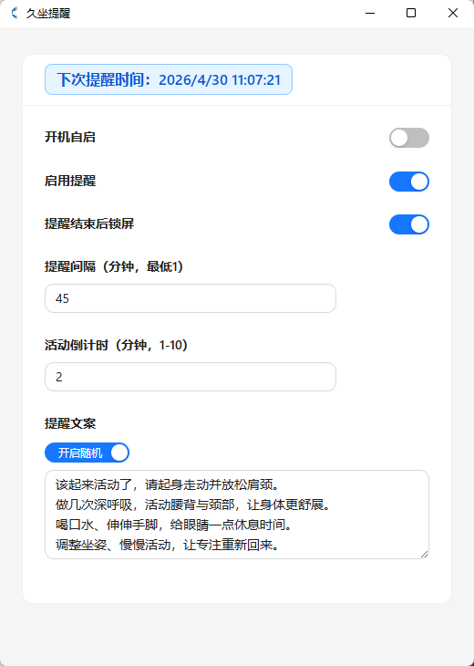
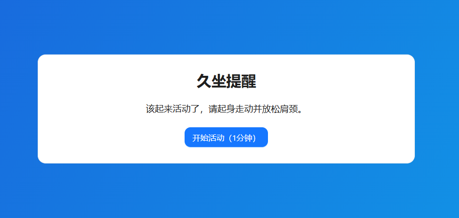

# 久坐提醒（Sedentary Reminder）

基于 **Tauri 2**、**Rust**、**React**、**Vite**、**TypeScript** 与 **Ant Design** 的跨平台桌面应用，用于按间隔提醒起身活动，减轻久坐带来的健康风险。

## AI 生成声明

本仓库中的源代码、配置与文档主体由 **人工智能（AI）辅助生成或编写**，并在人工审阅与迭代下维护。使用、分发或二次开发前请自行评估适用性与合规要求；作者与贡献者不对因使用本软件造成的任何直接或间接损失承担责任。详见 [`LICENSE`](LICENSE)。

## 功能概览

| 能力 | 说明 |
|------|------|
| 间隔提醒 | 可配置提醒间隔（分钟），到达时间后触发提醒流程 |
| 全屏提醒页 | 沉浸式全屏界面，展示提醒文案与活动倒计时 |
| 自定义文案 | 支持多条提醒语；可选随机展示；可从后端加载默认标语（Slogan） |
| 系统通知 | 集成系统级通知（含临近触发等场景） |
| 开机自启 | 与系统登录项联动（具体行为依赖操作系统） |
| 活动结束后锁屏 | 可选在提醒流程结束后锁定屏幕（Windows 平台相关能力） |
| 强制专注模式 | 在特定提醒状态下限制窗口关闭，避免误跳过 |
| 扩展能力 | 预留**补丁（Patch）**与**插件（Plugin）**目录及加载机制；运行时编译产物不入库 |

## 界面预览

### 图1：主界面



### 图2：提醒界面



## 技术栈

- 前端：React 18、Vite 5、Ant Design 5、TypeScript
- 桌面壳：Tauri 2
- 后端逻辑：Rust（命令层、提醒调度、平台能力等）

## 环境要求

- Node.js ≥ 18.17
- Rust（stable，建议 ≥ 1.75）
- npm ≥ 9
- 已安装 Tauri 2 所需系统依赖（Windows 需 Visual Studio Build Tools 等）

## 快速开始

```bash
npm install
npm run tauri dev
```

生产构建（需本机已配置 Tauri 打包环境）：

```bash
npm run tauri build
```

## Windows 安装包（GitHub Releases）

- **下载地址**：[Releases · F-95/sedentary-reminder](https://github.com/F-95/sedentary-reminder/releases)
- **构建方式**：向仓库推送 `v*` 标签（如 `v0.1.0`）后，由 [`.github/workflows/release.yml`](.github/workflows/release.yml) 在 `windows-latest` 上自动执行 `tauri build`，并创建 **草稿 Release（Draft）**，附带 NSIS 安装包（`*-setup.exe`）与 MSI（`*.msi`）。
- **正式发布**：在 GitHub 打开对应草稿 Release，补充说明后点击 **Publish release**。未代码签名的安装包在 Windows 上可能出现 **SmartScreen（智能屏幕）** 提示，属正常现象；仅信任本仓库官方 Release 资产后再运行即可。

以下为可直接粘贴到 Release 说明中的模板（按需修改）：

```markdown
## 久坐提醒 v0.1.0

### 安装
- 推荐一般用户：下载 `*-setup.exe`，按向导安装（当前用户目录，无需管理员）。
- 企业/静默场景：可选用 `.msi`。

### 说明
- 首次运行若出现 SmartScreen，请选择「仍要运行」或按企业策略放行。
- 功能与行为详见本仓库 README。
```

## 常用脚本

| 命令 | 作用 |
|------|------|
| `npm run dev` | 仅启动 Vite 前端开发服务 |
| `npm run build` | 前端 `tsc` + Vite 生产构建 |
| `npm run lint` / `npm run format` | 前端代码检查与格式化 |
| `npm run pack:patch` / `npm run pack:plugin` | 补丁 / 插件打包辅助脚本 |

## 目录说明（节选）

- `src/`：React 应用（页面、工具函数、`plugins/loader.tsx` 插件宿主等）
- `src-tauri/`：Rust 与 Tauri 配置、命令与核心业务
- `patches/`、`plugins/`：扩展包目录；**仅元数据与 schema 宜入库**，`backend/`、`frontend/` 下编译产物见 `.gitignore`
- `public/`：不参与 Vite 打包的静态资源

## Git 提交建议（摘要）

- **宜提交**：应用源码、`package-lock.json`、`Cargo.lock`、Tauri/工具链配置、图标与文档、补丁/插件的 `manifest` 与 schema 等。
- **勿提交**：`node_modules/`、`dist/`、`src-tauri/target/`、`.vite/`、`.cursor/`、`.env*`、日志与 IDE 私有个性化配置、补丁/插件已编译的 `backend`/`frontend` 产物。

细节以项目根目录 [`.gitignore`](.gitignore) 为准。

## 许可证

本项目采用 **Apache License 2.0**，全文见 [`LICENSE`](LICENSE)。

## 第三方与资源说明

界面与逻辑可能依赖开源组件（如 Ant Design、Tauri 等），各组件自有许可证；若使用在线音频或图片 URL，请遵守对应站点与版权要求。
