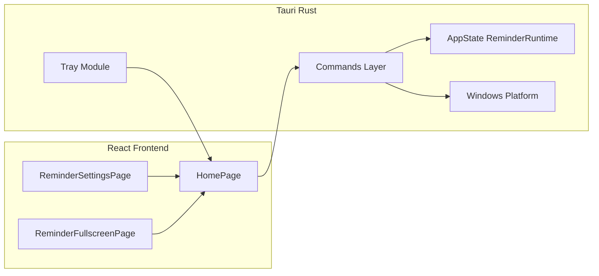
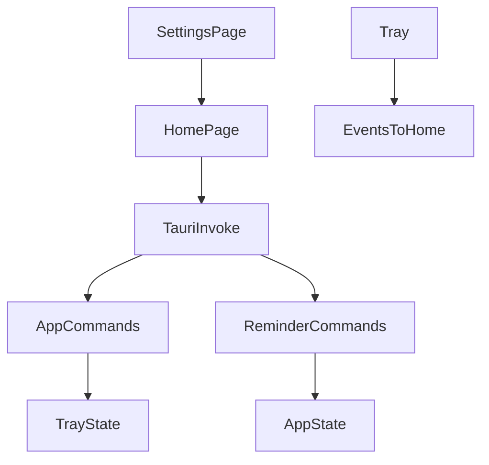
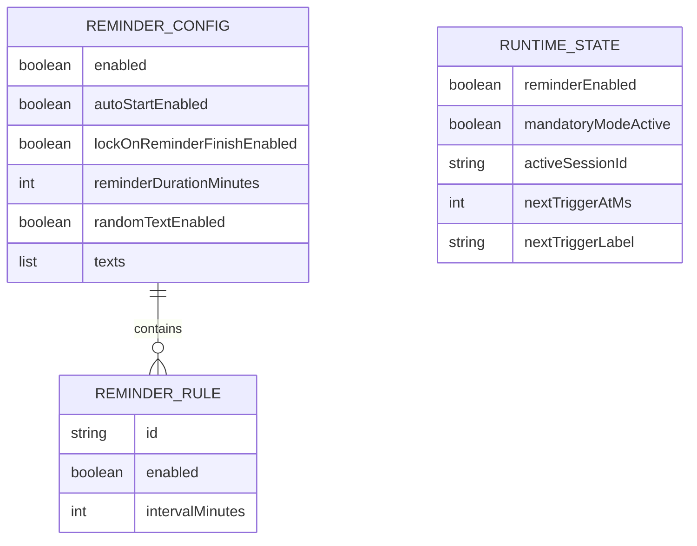

# 系统总体设计-第一版

## 1. 设计概述

### 1.1 设计目标

构建基于 Tauri 2 的桌面应用：前端 React 负责提醒配置持久化与调度触发；Rust 侧负责窗口模式切换、托盘、系统能力（通知插件托管、Windows 注册表自启、锁屏调用）及提醒运行时状态镜像。

### 1.2 设计约束

- 提醒调度主路径位于前端（浏览器定时器与页面生命周期）；后端维护运行态用于托盘展示与窗口协同。
- 禁止在无设计迭代批准的情况下更改扩展核心加载目录语义。
- Ant Design 主题全局收敛于根组件配置。

### 1.3 参考依据（需求规格说明书、全局开发共识）

《需求规格说明书-第一版》《文档元信息与全局开发共识-第一版》。

## 2. 整体架构设计

### 2.1 逻辑架构设计

| 逻辑分层 | 职责 |
|----------|------|
| 表现层（React） | 设置界面、全屏提醒页、本地配置迁移与持久化、触发调度与通知兜底 |
| 命令适配层（Tauri Commands） | 暴露窗口模式、运行时更新、会话控制、应用信息与系统操作 |
| 系统能力层（Rust Platform） | Windows 注册表自启、锁屏、Windows 企业层窗口加固 |
| 托盘服务（Rust Tray） | 托盘菜单、事件投递到前端主窗口 |
| 扩展占位（Patch / Plugin） | 列出补丁与插件元数据（第一版非核心） |

### 2.2 物理架构设计

- 单机桌面进程：单 WebView 窗口（主窗口 label 为 `main`）+ 托盘图标。
- 本地持久化：前端 `localStorage` 保存提醒配置；Rust 侧不写提醒业务配置。

### 2.3 架构拓扑图

## 3. 模块拆分与职责定义

### 3.1 核心模块拆分

- **HomePage 调度模块**：计算下次触发时间、触发提醒、通知兜底、会话生命周期。
- **ReminderSettingsPage**：间隔与文案等配置编辑入口。
- **ReminderFullscreenPage**：提醒呈现与活动倒计时交互。
- **reminder 命令模块**：窗口强制模式、运行时字段、默认标语列表。
- **app 命令模块**：应用信息、自启、托盘同步、退出。
- **tray 模块**：托盘菜单及 tooltip 聚合。
- **reminder_lock 模块**：锁屏封装。

### 3.2 模块职责边界

- 前端不得绕过命令直接操控托盘；托盘勾选必须通过后端事件通知前端再更新状态。
- 后端不持久化提醒间隔与文案；后端仅镜像「下次触发时间与标签」用于托盘提示。

### 3.3 模块依赖关系图

## 4. 前后端交互契约总览

### 4.1 统一请求格式规范

- 前端通过 Tauri `invoke` 传递驼峰命名字段对象；后端命令参数使用 serde 兼容映射。

### 4.2 统一响应格式规范

- 成功：返回单元类型或结构化 JSON（字段驼峰）。
- 失败：`Result::Err` 映射为字符串错误信息供前端展示。

### 4.3 全局错误码体系

第一版未引入数值错误码枚举；以可读字符串错误为主。迭代版本如需引入错误码表需在文档4扩展。

### 4.4 接口通用权限规则

- 所有命令默认信任本地进程内调用；无远程 RPC。
- 插件与补丁命令仅返回列举信息，不授予文件系统任意写权限。

## 5. 核心数据模型设计

### 5.1 实体关系定义

- **ReminderConfig（前端概念）**：启用标志、规则数组（第一版 UI 仅编辑首条规则）、自启、锁屏开关、活动时长、随机开关、文案数组。
- **ReminderRuntimeState（后端）**：提醒启用镜像、强制模式、会话 ID、下次触发时间与标签、焦点守护标志、锁定矩形、主屏中心在窗口内坐标。

### 5.2 ER图

### 5.3 核心数据流转规则

- 前端更新配置 → 本地持久化 → `invoke(sync_tray_menu)` 同步勾选 → `invoke(update_next_trigger)` 写入运行时。
- 触发提醒 → `set_reminder_window_mode(true)` → 前端展示全屏组件 → 用户开始活动 → `start_reminder_session` → 倒计时结束 → `finish_activity_and_lock` → `set_reminder_window_mode(false)`。

## 6. 核心状态机设计

### 6.1 核心业务状态定义

- **Idle**：提醒停用或未计算下次触发。
- **Armed**：已计算 `nextTriggerAt` 等待触发。
- **FullscreenPrompt**：提醒可见但未开始活动倒计时。
- **ActivityCountdown**：活动倒计时进行中（强制模式标志由后端会话承载）。
- **Recovering**：结束活动并恢复窗口常态。

### 6.2 状态流转规则

- Idle → Armed：启用提醒且未展示提醒界面。
- Armed → FullscreenPrompt：到达触发时间且未并发触发。
- FullscreenPrompt → ActivityCountdown：用户确认开始活动且会话启动成功。
- ActivityCountdown → Recovering：倒计时归零触发结束流程。
- Recovering → Armed：完成后重新计算下一次触发。

### 6.3 非法状态拦截规则

- 强制模式下拦截主窗口关闭请求。
- 结束活动时会话 ID 不匹配则拒绝以防串会话。

## 7. 架构风险与防控方案

### 7.1 潜在架构风险

- **计时漂移**：浏览器节流与系统休眠导致定时器延迟。
- **前后端状态不同步**：托盘 tooltip 依赖后端镜像字段更新不及时。
- **Windows 专属能力与跨平台预期错位**。

### 7.2 风险防控方案

- 增加秒级兜底轮询与可见性恢复检查；临近触发通知使用去重标记。
- 每次调度更新强制调用 `update_next_trigger`。
- 文档与 UI 提示非 Windows 平台能力差异；命令返回明确错误。

### 7.3 降级兜底方案

- 通知不可用 → 跳过。
- 铃声不可用 → 警告提示继续流程。
- 获取显示器失败 → 使用主显示器矩形兜底。
