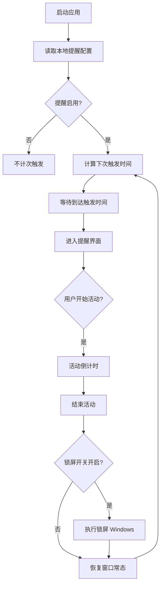
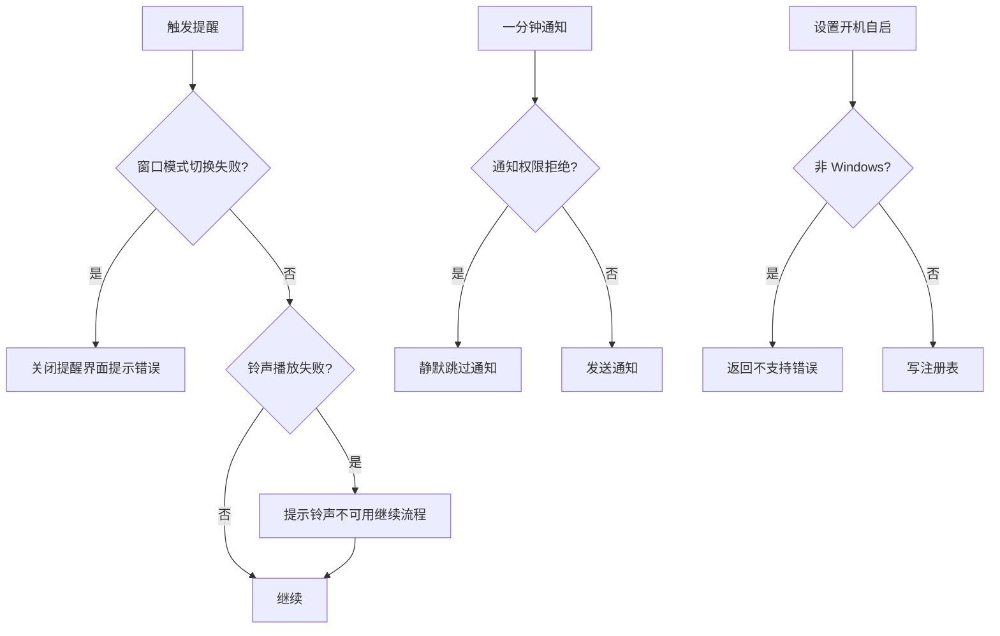

# 需求规格说明书-第一版

## 1. 需求概述

### 1.1 需求背景

久坐与健康风险相关，办公人群需要在工作中被温和打断以起身活动。桌面端应用可在后台持续运行并通过视觉强提示形成有效干预。

### 1.2 业务目标

提供可配置的久坐提醒能力：在用户设定的时间间隔到达后触发提醒流程，引导用户完成短时活动，并尽可能减少对正常工作流的干扰（例如关闭窗口进入托盘后台）。

### 1.3 预期价值

- 提升用户按时起身活动的依从性。
- 通过可配置文案与随机展示降低审美疲劳。
- 通过系统托盘与下次提醒提示增强「可感知性」。

## 2. 用户与场景定义

### 2.1 目标用户画像

- 长时间使用电脑的办公人员与开发者。
- 希望自定义提醒间隔与提醒文案的用户。
- 主要使用 Windows 桌面环境的用户（第一版能力对齐仓库实现）。

### 2.2 核心使用场景

- 用户启动应用，启用提醒并设置间隔；到达时间后出现全屏提醒，用户点击开始活动后进入倒计时，倒计时结束后关闭强制视图并可选择锁屏。
- 用户将应用最小化到托盘，间隔计时仍在运行（依赖前端页面生命周期与定时器；关闭主窗口选择托盘时进程保持）。
- 用户通过托盘菜单快速切换「开机启动」「启动提醒」「提醒结束后锁屏」。

### 2.3 边界使用场景

- 用户拒绝通知权限：临近一分钟通知可能不可用，但不得阻止定时触发主流程。
- 用户在网络不可用环境：远程铃声播放失败时应提示或降级，不应导致应用崩溃。
- 非 Windows 平台：开机自启与锁屏能力不可用，需返回可读错误提示。

## 3. 分级用户故事与验收标准

### 3.1 P0 核心用户故事与可量化验收标准

| 编号 | 用户故事 | 可量化验收标准 |
|------|----------|----------------|
| US-P0-01 | 作为用户，我希望设置提醒间隔并在启用后自动计时，以便周期性提醒我起身活动 | 启用提醒后，系统在不超过「间隔分钟数 + 10 秒」误差范围内触发提醒界面（排除机器休眠导致的时间冻结）；间隔取值范围为 1–360 分钟整数 |
| US-P0-02 | 作为用户，我希望在提醒出现时看到明确的沉浸式界面，以便我无法忽略 | 触发提醒后进入强制窗口模式：窗口铺满虚拟桌面联合区域、禁用关闭按钮行为受控；用户可通过界面流程进入活动倒计时 |
| US-P0-03 | 作为用户，我希望能够一键停用提醒 | 停用后不再调度下一次触发；托盘「启动提醒」可与该状态同步 |

### 3.2 P1 重要用户故事与可量化验收标准

| 编号 | 用户故事 | 可量化验收标准 |
|------|----------|----------------|
| US-P1-01 | 作为用户，我希望关闭主窗口时不直接丢失后台提醒 | 非强制模式下点击关闭：弹出或通过记忆偏好执行「托盘隐藏」或「退出」二选一；强制模式下关闭请求被拦截 |
| US-P1-02 | 作为用户，我希望托盘图标提示下次提醒时间 | 托盘悬停 tooltip 显示「下次提醒时间」字段；停用提醒时显示未启用文案 |
| US-P1-03 | 作为 Windows 用户，我希望配置开机自启 | 开启后在当前用户 Run 键写入应用路径；关闭后删除该项；删除不存在项视为成功 |
| US-P1-04 | 作为 Windows 用户，我希望活动结束后可选择锁屏 | 开关开启且会话校验通过时调用系统锁屏；开关关闭时不调用 |

### 3.3 P2 次要用户故事与可量化验收标准

| 编号 | 用户故事 | 可量化验收标准 |
|------|----------|----------------|
| US-P2-01 | 作为用户，我希望自定义多条提醒文案并可随机展示 | 文案支持多行输入存储为非空字符串数组；随机开关关闭时固定展示第一条非空文案 |
| US-P2-02 | 作为用户，我希望在触发前收到系统通知 | 距离下次触发剩余时间落在（0, 60] 秒区间内至多发送一次通知；需要系统授权 |
| US-P2-03 | 作为用户，我希望首次文案列表较短时加载后端默认标语 | 当前端本地文案条目数不大于 3 时，成功获取后端默认列表则用其替换 |

## 4. 业务流程设计

### 4.1 正常业务流程（附业务流程图）

### 4.2 异常业务流程（附异常处理流程图）

### 4.3 分支流程说明

- **提醒进行中**：会话标识与后端保存的激活会话匹配后才能结束活动并恢复窗口。
- **托盘切换字段**：托盘勾选变化事件驱动前端更新本地配置状态并写回本地存储。
- **休眠与节流**：除单次定时器外，存在每秒兜底检查以避免后台节流错过触发。

## 5. 功能边界定义

### 5.1 本次需求必须实现的功能

- 提醒启用开关、间隔配置（1–360 分钟）、活动倒计时配置（1–10 分钟）。
- 全屏覆盖式提醒视图与活动倒计时流程。
- 文案列表与随机展示策略。
- 关闭主窗口行为询问或记忆（托盘 / 退出）。
- Windows 开机自启与活动结束后锁屏。
- 托盘菜单与下次提醒摘要同步。

### 5.2 本次需求明确不实现的功能

- 免打扰时段 / 工作日历规则排除。
- 云端账号与多端同步配置。
- 精确到秒的跨平台睡眠唤醒补偿校准（仅采用前端计时与兜底轮询策略）。
- macOS / Linux 开机自启与锁屏的系统级统一实现。

### 5.3 后续迭代可扩展的功能

- 按多个免打扰时段自动推迟下一次触发（见第二版规格）。
- 托盘菜单扩展字段配置。
- 本地导入导出配置文件。
- 插件化铃声与主题扩展。

## 6. 非功能需求说明

### 6.1 性能需求

- 空闲状态下前端定时器与托盘同步调用频率不得持续占用显著 CPU（秒级轮询可接受）。
- 触发提醒时窗口布局计算应在人类可感知短时间内完成。

### 6.2 兼容性需求

- Windows 10 / 11 为主要兼容目标。
- 在非 Windows 平台编译运行时，缺失的能力必须以清晰错误返回而非崩溃。

### 6.3 安全性需求

- 强制提醒模式下阻止误关闭主窗口；解锁流程必须走完业务校验。
- 托盘事件仅触发布尔字段反转，不执行任意代码加载。

### 6.4 可用性需求

- 主要配置集中于单一设置卡片；下次触发时间可见。
- 文案输入支持多行直观编辑。

## 7. 需求变更记录

### 7.1 变更版本

第一版（基线固化）

### 7.2 变更内容

建立久坐提醒第一版需求基线，与现有仓库实现对齐。

### 7.3 变更原因

缺少归档的需求基准，迭代前需锁定范围。

### 7.4 变更影响范围

作为后续第二版（免打扰时段）比对基准。
