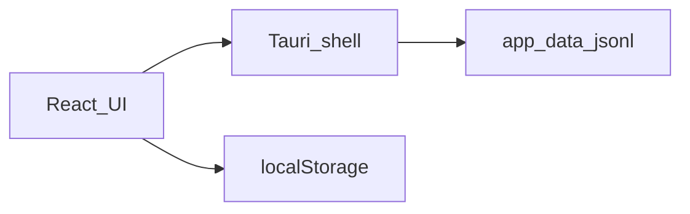
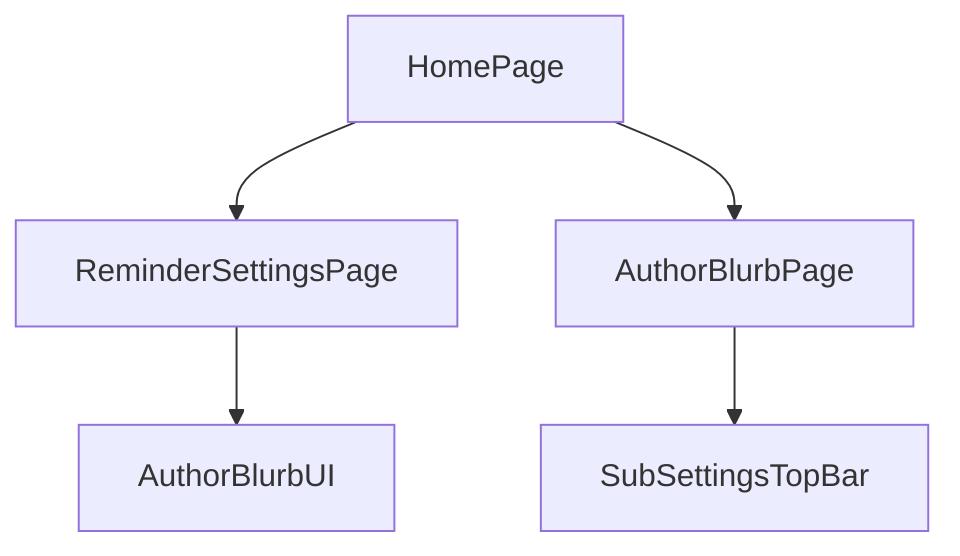

# 系统总体设计-第七版

> **【已锁定】** 锁定日期：2026-05-11。

## 1. 设计概述

### 1.1 设计目标

在第六版架构上增量：**壳层窗口标题配置**、**纯前端随笔子页**；不改变统计、主题、提醒调度与 `ReminderConfig`。

### 1.2 设计约束

- 无服务端；随笔不持久化用户操作。
- 不修改扩展系统 `extensions/` 核心实现。
- 不新增 Tauri 命令。

### 1.3 参考依据（需求规格说明书、全局开发共识）

《需求规格说明书-第七版》《文档元信息与全局开发共识-第七版》。

## 2. 整体架构设计

### 2.1 逻辑架构设计

- **表现层**：在第六版基础上新增 `AuthorBlurbPage`（静态 `Typography`）。
- **壳层**：`tauri.conf.json` 提供初始窗口标题；运行时不在第七版强制 `setTitle`（依赖配置即可）。
- **数据层**：与第六版相同（localStorage + JSONL）。

### 2.2 物理架构设计

单进程桌面应用；随笔资源打入前端 bundle。

### 2.3 架构拓扑图

与第六版拓扑一致。

## 3. 模块拆分与职责定义

### 3.1 核心模块拆分

| 模块 | 职责 |
|------|------|
| WindowBranding | `tauri.conf.json` + `index.html` 标题字符串对齐 |
| AuthorBlurbUI | `AuthorBlurbPage` 展示与 `SubSettingsTopBar` 返回 |
| HubNav | `ReminderSettingsPage` 增加 `onOpenAuthorBlurb` 链式入口 |

### 3.2 模块职责边界

随笔模块不调统计、不改主题、不写配置；`HomePage` 仅扩展视图枚举与分支渲染。

### 3.3 模块依赖关系图

## 4. 前后端交互契约总览

### 4.1 统一请求格式规范

第七版无新增 `invoke`。

### 4.2 统一响应格式规范

与第六版一致。

### 4.3 全局错误码体系

与第六版一致。

### 4.4 接口通用权限规则

与第六版一致；无 capability 变更。

## 5. 核心数据模型设计

### 5.1 实体关系定义

无新增持久化实体；随笔文案为前端常量/JSX 文本。

### 5.2 ER图

不适用。

### 5.3 核心数据流转规则

与第六版一致；第七版不引入新数据流。

## 6. 核心状态机设计

### 6.1 核心业务状态定义

`settingsView`: `main | sedentary | hydration | quiet | stats | author`。

### 6.2 状态流转规则

`main` ↔ `author`；与 `stats` 等子页同等：离开 `main` 时枢纽秒级倒计时暂停规则与第六版一致。

### 6.3 非法状态拦截规则

无新增非法态；`author` 与全屏提醒正交（全屏出现时底层状态由既有逻辑管理）。

## 7. 架构风险与防控方案

### 7.1 潜在架构风险

标题过长导致极小窗口标题栏截断（OS 行为）。

### 7.2 风险防控方案

接受系统截断；主窗最小尺寸沿用第六版。

### 7.3 降级兜底方案

若某环境未应用 `tauri.conf` 标题（极少见），以 `index.html` 与产品说明补救；不在第七版强制运行时 `setTitle`。
