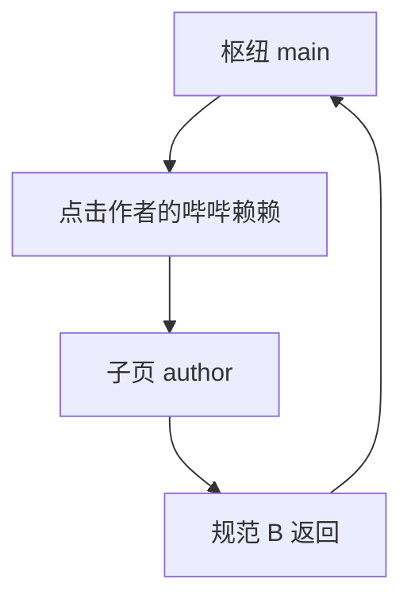
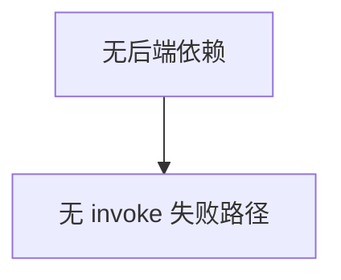

# 需求规格说明书-第七版

> **【已锁定】** 锁定日期：2026-05-11。

## 1. 需求概述

### 1.1 需求背景

第六版主题与统计已稳定。产品希望在窗口层面强化情感化定位（健康搭子），并在应用内提供作者的简短自述与公众号署名，增强信任与传播触点。

### 1.2 业务目标

- **品牌化标题**：主窗口与 Web 文档标题展示副标题「你的健康搭子」。
- **作者随笔**：主设置枢纽增加入口，进入只读子页展示固定文案与署名。

### 1.3 预期价值

用户一眼识别产品定位；低成本了解作者动机与关注渠道；不改变核心提醒链路。

## 2. 用户与场景定义

### 2.1 目标用户画像

已安装或使用久坐提醒的用户；愿意阅读简短说明、关注作者公众号的受众。

### 2.2 核心使用场景

- 用户打开应用 → 任务栏/标题栏显示 **久坐提醒（你的健康搭子）**。
- 用户在主设置页点击 **作者的哔哔赖赖** → 阅读分段正文 → 点击左上返回 **主界面**。

### 2.3 边界使用场景

- 仅 Web 预览（非 Tauri）：浏览器标签标题仍与 `index.html` 一致。
- 多显示器/高 DPI：标题栏文案由系统渲染，以 OS 截断规则为准（本需求不强制自定义标题栏控件）。

## 3. 分级用户故事与验收标准

### 3.1 P0 核心用户故事与可量化验收标准

| 编号 | 用户故事 | 可量化验收标准 |
|------|----------|----------------|
| US7-P0-01 | 作为用户，我希望窗口标题体现产品定位 | Tauri 打包运行后，主窗口标题栏字符串**精确**为 `久坐提醒（你的健康搭子）` |
| US7-P0-02 | 作为用户，我希望在设置里读到作者说明 | 枢纽存在链式入口「作者的哔哔赖赖」；子页顶栏标题同文案；正文包含：十年程序员、爱吃不爱动、压抑与体检、做软件初衷、写稿被提醒打断、祝福健康；文末单独展示「我是乘澜，微信公众号：乘澜 charlan」 |
| US7-P0-03 | 作为用户，我希望子页能返回枢纽 | 子页首行左侧为规范 B **仅图标**返回（`aria-label`/`title` 含「返回主界面」），返回后 `settingsView` 为 `main` |

### 3.2 P1 重要用户故事与可量化验收标准

| 编号 | 用户故事 | 可量化验收标准 |
|------|----------|----------------|
| US7-P1-01 | 作为用户，我不希望新功能影响提醒 | 完成 US7-P0-02 往返后，久坐/补水调度与第六版一致；无新增崩溃 |
| US7-P1-02 | 作为开发，我希望文档标题一致 | 根目录 `index.html` 中 `<title>` 与 US7-P0-01 字符串一致 |

### 3.3 P2 次要用户故事与可量化验收标准

| 编号 | 用户故事 | 可量化验收标准 |
|------|----------|----------------|
| US7-P2-01 | 作为用户，我希望小屏也能读完 | 窗口高度取第六版最小约 660px 时，随笔区可滚动，末尾署名可见（滚动到底） |

## 4. 业务流程设计

### 4.1 正常业务流程（附业务流程图）

### 4.2 异常业务流程（附异常处理流程图）

第七版随笔页无 `invoke`；异常场景与第六版提醒链路相同，不在本版扩展。

### 4.3 分支流程说明

- `author` 与 `stats`/`sedentary` 等并列，由 `HomePage` 视图状态切换；**不**使用路由库新路径。
- 切入 `main` 时行为与第六版一致（含 `statsRefreshKey` 刷新规则，第七版不修改该规则）。

## 5. 功能边界定义

### 5.1 本次需求必须实现的功能

主窗标题字符串、`index.html` 标题、枢纽入口、`AuthorBlurbPage` 展示与返回。

### 5.2 本次需求明确不实现的功能

微信公众号 URL  Scheme / 外部浏览器自动打开；多语言切换；随笔内容在线更新；全屏提醒页标题同步副标题（若未单独立项则不在本版范围）。

### 5.3 后续迭代可扩展的功能

随笔内可点击跳转公众号；关于页版本号；全屏页标题与主窗统一副标题。

## 6. 非功能需求说明

### 6.1 性能需求

随笔页首屏渲染无额外网络请求；包体增量可忽略（单文件静态文案）。

### 6.2 兼容性需求

与第六版 Windows 目标一致；标题 UTF-8。

### 6.3 安全性需求

不收集阅读时长；不嵌入第三方脚本。

### 6.4 可用性需求

入口文案口语化、与产品气质一致；返回控件位置与第六版子页一致。

## 7. 需求变更记录

### 7.1 变更版本

第七版

### 7.2 变更内容

主窗口品牌化标题；作者随笔子页与枢纽入口。

### 7.3 变更原因

品牌表达与作者渠道露出。

### 7.4 变更影响范围

`tauri.conf.json`、`index.html`、`HomePage.tsx`、`ReminderSettingsPage.tsx`、新增 `AuthorBlurbPage.tsx`。
