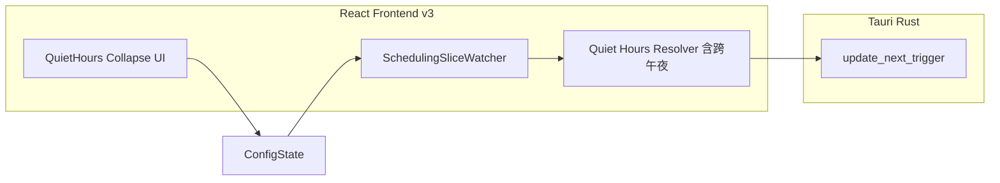
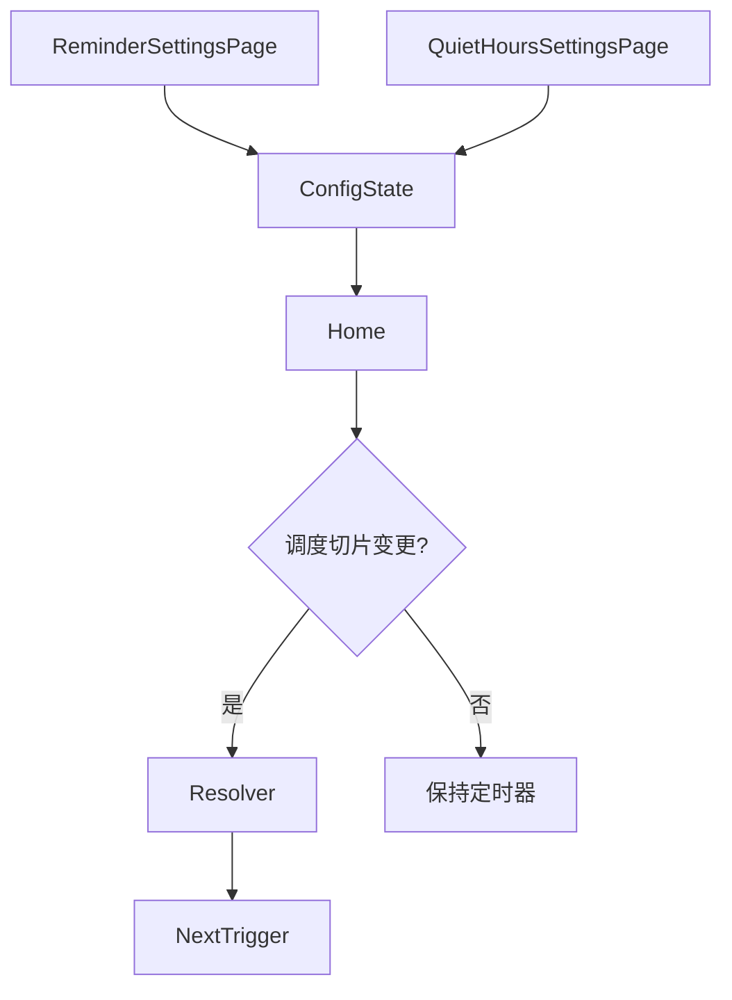

# 系统总体设计-第三版

> **【已锁定】** 锁定日期：2026-05-09。本文件为久坐提醒第三版基线文档，禁止直接修改；变更须于新版本目录全套归档。

## 1. 设计概述

### 1.1 设计目标

在第二版架构上细化前端调度层职责边界：**区分「排程重算触发条件」与「展示/行为配置读取时机」**，避免非调度配置变更破坏用户对下次触发时刻的预期；免打扰设置视图增加折叠式信息架构以压缩视觉占用。

### 1.2 设计约束

- 后端仍不承担间隔调度；`update_next_trigger` 契约不变。
- 数据模型字段名不变；`QuietHourRange` 增加**跨午夜**解释（`startMinutes > endMinutes`），推迟算法在绝对时间轴上计算命中与离开边界；**同日段**行为与第二版一致。
- 折叠状态不写入持久化。

### 1.3 参考依据（需求规格说明书、全局开发共识）

《需求规格说明书-第三版》《文档元信息与全局开发共识-第三版》《系统总体设计-第二版》。

## 2. 整体架构设计

### 2.1 逻辑架构设计

在第二版模块表基础上增量：

| 模块 | 第三版增量职责 |
|------|----------------|
| 调度编排（`HomePage`） | 仅在「调度切片」变化或影响暂停调度的显隐状态变化时，重建本地单次触发定时器并调用 `update_next_trigger`；非调度字段变更不进入该路径 |
| 触发执行（`HomePage`） | 弹出提醒时从**当前内存配置**读取随机文案开关、文案列表、活动时长等 |
| 免打扰 UI | 时段列表由折叠面板承载；摘要行展示由工具函数统一格式化；页内说明跨午夜与左闭右开 |
| 推迟模块（纯函数） | 支持跨午夜段命中、每段离开边界取整分时刻；多段同时命中时离开边界取 **max**（与第二版同日重叠语义一致） |

### 2.2 物理架构设计

不变：单机进程 + 前端 localStorage v2。

### 2.3 架构拓扑图

## 3. 模块拆分与职责定义

### 3.1 核心模块拆分

- **调度切片定义**：参与 `computeNextTriggerWithQuietHours`（及提醒总开关、会话显隐导致的暂停）的字段集合；文档化并列举排除字段。
- **时段摘要模块**：将日内分钟索引转为 `HH:mm-HH:mm` 展示串，供折叠标题使用。

### 3.2 模块职责边界

`ReminderSettingsPage` 与 `QuietHoursSettingsPage` 仍只负责编辑与回写 `ReminderConfig`；**是否重算 next** 由 `HomePage` 调度逻辑根据切片变更判定，页面组件不直接调用 `update_next_trigger`。

### 3.3 模块依赖关系图

## 4. 前后端交互契约总览

### 4.1 统一请求格式规范

不变；camelCase。

### 4.2 统一响应格式规范

不变。

### 4.3 全局错误码体系

不变；推迟迭代上限告警仍由前端触发。

### 4.4 接口通用权限规则

不变；第三版不增加 invoke 参数。

## 5. 核心数据模型设计

### 5.1 实体关系定义

字段名与第二版一致；`QuietHourRange` 语义扩展：**`startMinutes < endMinutes`** 为同日左闭右开；**`startMinutes > endMinutes`** 为跨午夜（当日 `start` 至次日 `end`）；**`startMinutes === endMinutes`** 禁止，清洗为最短同日 1 分钟。

### 5.2 ER图

与第二版相同（`REMINDER_CONFIG` 与 `QUIET_HOUR_RANGE` 关系不变）。

### 5.3 核心数据流转规则

- 任意配置变更仍即时 `persistReminderConfigV2`（与第二版一致）。
- **仅当调度切片变更**（或进入/退出应暂停调度的提醒显隐状态）时，重新计算 next 并调用 `update_next_trigger`。
- 非调度字段变更：仅更新存储与托盘等侧效应，**不**因本迭代需求而改写已同步的 next 镜像（除非与第二版一致的其它路径触发了清空，如关闭提醒）。

## 6. 核心状态机设计

### 6.1 核心业务状态定义

在第二版 `Armed` 相关状态上明确：

- `Armed` 下一次触发时刻的**重算**仅由调度切片驱动；非调度配置变更不改变 `next_trigger_at_ms` 镜像（在仍处于 `Armed` 且满足第二版计时条件时）。

### 6.2 状态流转规则

进行中全屏提醒与第二版相同：暂停 next 重算直至会话结束路径恢复。

### 6.3 非法状态拦截规则

与第二版相同；折叠 UI 不改变校验规则。跨午夜段仍须满足清洗后 `start !== end`；段数上限仍为 20。

## 7. 架构风险与防控方案

### 7.1 潜在架构风险

- **陈旧闭包**：收窄调度依赖后，若触发回调仍引用旧配置，可能导致随机文案或活动时长与界面不一致。
- **依赖数组误改**：未来维护将 `config` 整体重新加入依赖导致回归。
- **夏令时/非 24h 日**：本地日边界异常可能导致单次触发偏移；与第二版同属前端本地时间语义风险。

### 7.2 风险防控方案

- 触发路径显式读取「最新配置引用」（由前端详细设计约定具体手段）；代码审查检查调度 `useEffect` 依赖列表。
- 在调度 `useEffect` 近旁保留中文注释列出包含/排除字段。

### 7.3 降级兜底方案

- 关闭提醒总开关：与第二版一致清空 next。
- 用户若感知异常：可通过修改间隔强制触发重算作为自助恢复手段（产品可在帮助中说明）。
