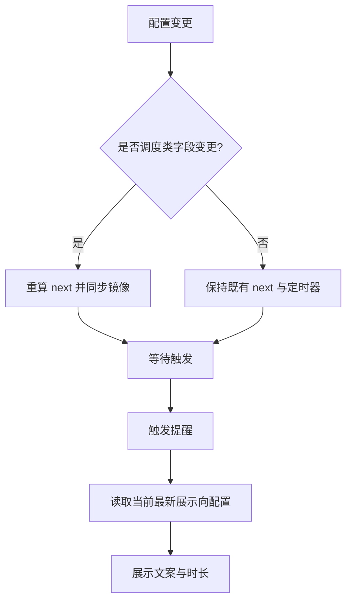
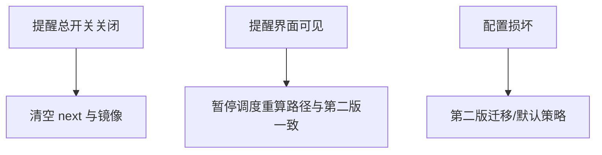

# 需求规格说明书-第三版

> **【已锁定】** 锁定日期：2026-05-09。本文件为久坐提醒第三版基线文档，禁止直接修改；变更须于新版本目录全套归档。

## 1. 需求概述

### 1.1 需求背景

第二版已支持免打扰与推迟调度，但主界面将「下次提醒时间」与**整份**提醒配置绑定刷新：用户调整与**何时响铃无关**的选项（如开机自启、锁屏、随机文案）时，已显示的下次触发时刻会被重算，造成困惑。免打扰列表在段数增多时占用纵向空间，需通过折叠与摘要提升可读性。夜间休息场景需要**跨午夜**免打扰（如 22:00–次日 06:00），第二版仅支持同日段，需在第三版补齐。

### 1.2 业务目标

- **稳定预期**：非调度类开关变更不改变已排程的下次提醒时刻与后端运行时镜像中的 next 字段（在提醒仍启用且未处于应暂停调度的会话状态下）。
- **高效浏览**：免打扰各段可折叠，折叠态即可识别时段范围。
- **夜间连续禁区**：支持配置结束时刻早于开始时刻的跨午夜段，推迟算法与第二版链式逻辑兼容。

### 1.3 预期价值

减少误触导致的「下次提醒时间跳动」投诉；降低免打扰页信息噪音，提升设置效率。

## 2. 用户与场景定义

### 2.1 目标用户画像

与第二版一致；新增强诉求为「希望改自启/锁屏/文案不影响倒计时」的用户。

### 2.2 核心使用场景

- 用户已启用提醒并看到「下次提醒时间为 T」；仅关闭「开启随机文案」或切换「开机自启」「提醒结束后锁屏」后，**T 保持不变**（与系统时间自然流逝无关的展示应一致）。
- 用户修改提醒间隔或免打扰规则后，系统按第二版规则**重新计算**下次触发并更新展示与托盘镜像。
- 用户在免打扰页将某段折叠，标题仍显示如 **12:00-14:00** 或 **22:00-06:00**（跨午夜）；展开后可编辑与删除。
- 用户配置跨午夜段后，候选触发落在晚间或清晨禁区内时，下次触发推迟至离开该段后的**结束整点**再叠加完整间隔（与同日段「离开边界 + 间隔」一致）。

### 2.3 边界使用场景

- 提醒总开关关闭：下次触发清空或与第二版一致的不展示逻辑，不适用「保持 T」表述。
- 全屏提醒展示中：调度暂停逻辑与第二版一致；会话结束后重新按配置排程。
- 用户先改间隔再立即改随机文案：最终下次触发应以间隔变更后的重算结果为准，随机文案变更**单独**不得再次推动重算。

## 3. 分级用户故事与验收标准

### 3.1 P0 核心用户故事与可量化验收标准

| 编号 | 用户故事 | 可量化验收标准 |
|------|----------|----------------|
| US3-P0-01 | 作为用户，我希望切换开机自启时不改变已排程的下次提醒 | 前置：提醒启用、已存在非空 next 展示；仅切换 `autoStartEnabled`；操作前后 `nextTriggerAt` 展示值与后端镜像标签对应同一时刻（允许展示格式相同、时间戳一致） |
| US3-P0-02 | 作为用户，我希望切换「提醒结束后锁屏」时不改变已排程的下次提醒 | 前置同上；仅切换 `lockOnReminderFinishEnabled`；next 时刻与镜像不变 |
| US3-P0-03 | 作为用户，我希望切换「开启随机文案」时不改变已排程的下次提醒 | 前置同上；仅切换 `randomTextEnabled`；next 时刻与镜像不变 |
| US3-P0-04 | 作为用户，我仍希望在改间隔或免打扰时得到更新的下次提醒 | 修改任一启用规则的间隔、或修改免打扰总开关/任一段启用与起止；next 按推迟算法（含跨午夜）重算并更新展示与镜像 |
| US3-P0-05 | 作为用户，我希望配置跨午夜免打扰后提醒在清晨正确恢复 | 配置 `startMinutes > endMinutes`（如 22:00–06:00）；候选落入禁区内时，next 为**离开禁区边界时刻 + 胜出规则间隔**；06:00 整点不属于禁区内（左闭右开）；与同日内多段重叠取**最晚离开边界**的规则兼容 |

### 3.2 P1 重要用户故事与可量化验收标准

| 编号 | 用户故事 | 可量化验收标准 |
|------|----------|----------------|
| US3-P1-01 | 作为用户，我希望每段免打扰可折叠且看到时间摘要 | 每段具备展开/收起；折叠态标题可见 **HH:mm-HH:mm**（与该行 start/end 分钟索引一致，24 小时制、两位补零；跨午夜时结束数字可小于开始） |
| US3-P1-02 | 作为用户，我希望禁用段在折叠时仍可辨识 | 段 `enabled=false` 时，折叠标题除摘要外有「已关闭」或等价可读标识（可选 Tag/辅助文案） |
| US3-P1-03 | 作为用户，我希望首次进入免打扰页仍能看到全部编辑项 | 默认所有段处于展开状态；用户可手动折叠 |

### 3.3 P2 次要用户故事与可量化验收标准

| 编号 | 用户故事 | 可量化验收标准 |
|------|----------|----------------|
| US3-P2-01 | 作为用户，我希望提醒弹出时使用我当前选择的文案策略 | 在仅变更随机文案开关而不重算 next 的场景下，**实际弹出提醒时**展示的选句规则与当前开关一致（随机或首条） |
| US3-P2-02 | 作为用户，我希望活动时长等展示配置在弹出时生效 | 在变更 `reminderDurationMinutes` 不重算 next 的前提下，弹出提醒的倒计时时长与当前配置一致 |

## 4. 业务流程设计

### 4.1 正常业务流程（附业务流程图）

### 4.2 异常业务流程（附异常处理流程图）

### 4.3 分支流程说明

- **调度类字段**：`enabled`、`rules`（含各规则 `enabled` 与 `intervalMinutes`）、`quietHoursEnabled`、`quietHours`（含各段 `enabled`、`startMinutes`、`endMinutes`）；其中 `startMinutes > endMinutes` 表示跨午夜段，左闭右开；`startMinutes === endMinutes` 禁止（清洗为最短同日 1 分钟）。
- **非调度类字段**（第三版明确不得单独触发 next 重算）：`autoStartEnabled`、`lockOnReminderFinishEnabled`、`randomTextEnabled`；以及不参与推迟算法的字段如 `reminderDurationMinutes`、`texts`。
- **托盘**对开机自启与锁屏的切换：与主界面开关等价，仍属非调度类变更。

## 5. 功能边界定义

### 5.1 本次需求必须实现的功能

- 前端调度副作用的依赖边界与注释说明；触发提醒时读取最新展示向配置的行为约定。
- 免打扰页基于 Ant Design 折叠容器的时段列表；时段摘要格式化规则；页内说明**支持跨午夜**及左闭右开语义。
- 推迟算法支持跨午夜命中、离开边界与链式推迟；持久化键与字段名不变；后端命令**不 breaking**。

### 5.2 本次需求明确不实现的功能

- 折叠状态跨会话持久化。
- 后端参与调度或解析免打扰。
- 托盘展示下次触发是否因「非调度变更」而保持不变的调试信息。

### 5.3 后续迭代可扩展的功能

- 可配置「改活动时长是否重算 next」的策略开关。
- 免打扰段拖拽排序与模板导入。
- 按星期/工作日维度配置免打扰。

## 6. 非功能需求说明

### 6.1 性能需求

折叠交互不得引入可感知卡顿；重算边界收紧不得增加额外轮询。

### 6.2 兼容性需求

第二版配置无迁移格式升级；老用户升级第三版应用后读写 v2 配置无冲突。

### 6.3 安全性需求

与第二版一致；不扩大 invoke 面。

### 6.4 可用性需求

折叠标题在窄窗口下不断字、不溢出关键摘要；与 Ant Design 全局主题一致，禁止深度覆盖组件内置结构。

## 7. 需求变更记录

### 7.1 变更版本

第三版

### 7.2 变更内容

补充「非调度开关不刷新 next」与「免打扰段折叠 + 时间摘要」；明确触发时读取最新文案/时长。增补**跨午夜免打扰**（`startMinutes > endMinutes`）、清洗零长度段、推迟算法基于绝对时间离开边界。

### 7.3 变更原因

消除用户对下次提醒时间「无故变化」的困惑；提升免打扰长列表可用性。

### 7.4 变更影响范围

前端 `HomePage` 调度逻辑、`QuietHoursSettingsPage` 布局与说明、`quietHours` 推迟与清洗逻辑、类型注释；测试与设计文档第三版同步修订。
