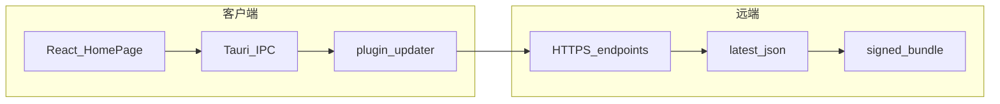
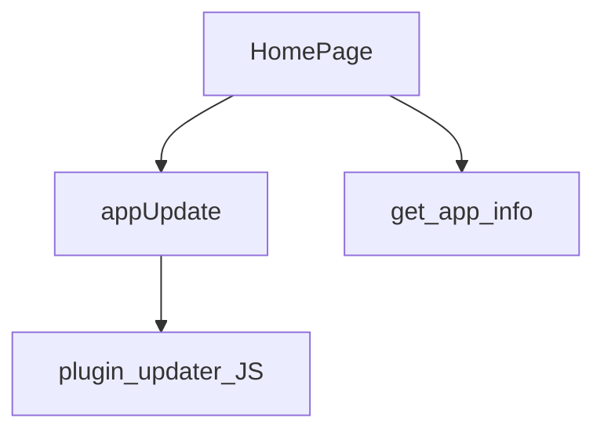

# 系统总体设计-第九版

> **【已锁定】** 锁定日期：2026-05-14。

## 1. 设计概述

### 1.1 设计目标

在第八版业务架构不变前提下，扩展 **Windows 安装与 Web 渲染兼容层**，并增加 **Tauri Updater 驱动的应用级更新闭环**；主界面增加 **版本展示与更新入口**。

### 1.2 设计约束

- 不修改 `src-tauri/src/extensions/` 核心扩展目录的既有禁区规则。
- 更新能力依赖 **Tauri 官方插件**与 **capabilities**，禁止绕过 capability 直接暴露危险 IPC。
- **私钥**不得进入仓库与构建产物。

### 1.3 参考依据

《需求规格说明书-第九版》《文档元信息与全局开发共识-第九版》、Tauri v2 Updater 与 Bundler 文档。

## 2. 整体架构设计

### 2.1 逻辑架构设计

- **表现层**：React（HomePage 底部栏）调用 **@tauri-apps/plugin-updater** 与 **plugin-process**。
- **壳层**：Tauri 主进程注册 **updater**、**process**、**notification** 插件；**get_app_info** 返回构建期版本与固定 **bundle identifier**。
- **分发层**：静态或动态 **HTTPS** 更新描述（含 **platforms** 与 **signature**）；安装包由 **bundler** 产出 NSIS/MSI 及 **.sig** 附属品（createUpdaterArtifacts）。

### 2.2 物理架构设计

- 客户端：单机桌面应用；本地 JSONL 统计不变。
- 更新托管：默认示例指向 **GitHub Releases** 路径下的 **latest.json**（可替换为自建 CDN）；构建机在受控环境持有 **TAURI_SIGNING_PRIVATE_KEY**。

### 2.3 架构拓扑图

## 3. 模块拆分与职责定义

### 3.1 核心模块拆分

- **版本与更新模块**：`appUpdate.ts` 封装 check 与 install+relaunch；`HomePage` 负责 UI 状态与 Modal。
- **应用信息模块**：`commands/app::get_app_info` 单一真相版本号。
- **发布配置模块**：`tauri.conf.json` 的 `bundle`、`plugins.updater`。
- **脚本模块**：`scripts/version.mjs` 同步三处版本。

### 3.2 模块职责边界

- 更新下载与签名校验由 **插件与 Tauri 核心**完成，前端不直接校验签名文件内容。
- WebView2 引导由 **安装包**完成，非运行时 Rust 业务代码职责。

### 3.3 模块依赖关系图

## 4. 前后端交互契约总览

### 4.1 统一请求格式规范

- **get_app_info**：无参 invoke，返回 **camelCase** 的 **name、version、appId**。
- **updater**：走插件通道，非业务自定义 invoke。

### 4.2 统一响应格式规范

- **AppInfo**：与第八版字段名一致；**version** 为 **semver** 字符串；**appId** 与 `identifier` 一致。

### 4.3 全局错误码体系

- 沿用第八版业务命令错误字符串策略；更新失败以 **插件抛出异常** 转中文摘要展示。

### 4.4 接口通用权限规则

- **default** capability 增加 **updater:default**、**process:default**。

## 5. 核心数据模型设计

### 5.1 实体关系定义

- **AppInfo**：独立 DTO，无持久化表。
- **Update 元数据**：运行时由插件解析，不写入本地业务数据库。

### 5.2 ER图

本迭代无新增持久化实体，略。

### 5.3 核心数据流转规则

- 版本号：**Cargo.toml** 为 Rust 单一来源 → **get_app_info** → UI；**tauri.conf.json** 与 **package.json** 与脚本保持同步。
- 更新：**endpoints** → JSON → 校验 **signature** → 下载 **url** → 安装 → **relaunch**。

## 6. 核心状态机设计

### 6.1 核心业务状态定义

- **updateIdle**：未在检查。
- **updateChecking**：请求更新源中。
- **updatePrompt**：已发现新版本，等待用户确认。
- **updateInstalling**：下载并安装中（Windows 可能很快退出进程）。

### 6.2 状态流转规则

**updateIdle** →（点击刷新）→ **updateChecking** →（无更新）→ **updateIdle**；→（有更新）→ **updatePrompt** →（确认）→ **updateInstalling**；→（取消）→ **updateIdle** 并释放资源。

### 6.3 非法状态拦截规则

- **updateChecking** 期间禁止重复触发检查（按钮禁用或 spin）。

## 7. 架构风险与防控方案

### 7.1 潜在架构风险

- **Win7** 上 WebView2 与 Tauri 运行时尾部兼容性风险。
- **公钥与私钥**轮换导致老版本无法验证新签名。
- **endpoints** 404 或 JSON 不完整导致检查失败。

### 7.2 风险防控方案

- 文档与测试矩阵明确 **主基线 Win10**；Win7/8 标注前置条件。
- 密钥轮换走大版本或专门迁移文档；保留旧公钥多 endpoint 过渡（后续迭代）。
- 发布 checklist 校验 **latest.json** 与 **.sig** 成对存在。

### 7.3 降级兜底方案

- 自动更新失败时引导用户至 **Release 页**手动下载完整安装包（文档与可选外链，第九版 P2）。
