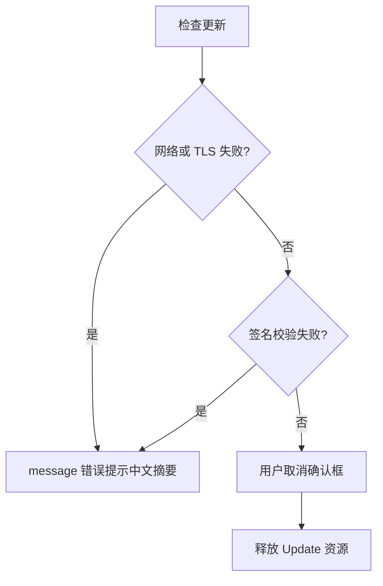

# 需求规格说明书-第九版

> **【已锁定】** 锁定日期：2026-05-14。

## 1. 需求概述

### 1.1 需求背景

第八版枢纽与统计能力已稳定。用户环境覆盖 **Windows 7、Windows 8.1、Windows 10** 等仍存在旧 **WebView2** 或缺少运行时的机器；同时需要知晓当前安装版本并便捷获取安全更新，避免手动查找安装包。

### 1.2 业务目标

- **跨 Windows 版本可用性**：在合理前置条件（尤其 WebView2）下，主流程可在 Win7/8/10 上启动与使用；安装包引导安装或升级 WebView2 运行时。
- **版本可见**：主界面最底部展示 **v{语义化版本}**，与安装包一致。
- **可检查更新**：版本号旁提供 **刷新图标**，触发联网检查；若有新版本，用户确认后完成下载安装并重启。

### 1.3 预期价值

降低环境差异导致的启动失败与「是否最新版」不确定性；提升安全修复与功能迭代的触达效率。

## 2. 用户与场景定义

### 2.1 目标用户画像

使用 Windows 桌面、需长期后台提醒的办公用户；部分仍在 Win7/8 或受限企业网络环境。

### 2.2 核心使用场景

- 用户打开应用 → 底部见 **v0.1.9**（示例）→ 点击刷新图标 → 无新版本 → 提示 **当前已是最新版本**。
- 用户点击刷新 → 发现更高版本 → 弹窗展示版本号与说明 → 确认 **下载并安装** → 进程按系统规则退出并完成安装 → **自动重启** 至新版本。
- 用户在 **Win10** 首次安装 → 安装器按策略下载或引导 **WebView2** → 应用正常显示界面。

### 2.3 边界使用场景

- **Win7/8**：WebView2 常青支持已结束，仅依赖用户或安装包能提供的 **兼容固定版运行时**；若无法满足，应用可能无法渲染（白屏），须在文档中列为 **环境前置条件未满足**，不记为应用逻辑缺陷。
- **离线或更新源不可达**：检查更新失败，展示 **中文错误原因摘要**（网络、TLS、404、签名校验失败等归类说明）。
- **非 Tauri 环境**（纯浏览器调试）：底部版本可能为 **未知** 或 invoke 失败提示策略与既有命令一致。

## 3. 分级用户故事与可量化验收标准

### 3.1 P0 核心用户故事与可量化验收标准

| 编号 | 用户故事 | 可量化验收标准 |
|------|----------|----------------|
| US9-P0-01 | 作为用户，我希望在主界面底部看到当前版本号 | 任意页面视图下，主窗口底部固定区域展示 **v{semver}**，与 `get_app_info.version` 及 `tauri.conf.json` 的 `version` **完全一致** |
| US9-P0-02 | 作为用户，我希望点击刷新图标检查更新 | 点击后 **60 秒内**完成一次检查或给出明确失败提示；检查过程中刷新图标处于 **加载态**（旋转或禁用防重复） |
| US9-P0-03 | 作为用户，我希望无更新时有明确反馈 | 当更新源判定无更高版本时，出现 **成功类提示**：「当前已是最新版本」 |
| US9-P0-04 | 作为用户，我希望有更新时可选择安装 | 发现更高版本时弹出 **确认对话框**，含版本号与可选更新说明；用户取消则不安装且不崩溃 |
| US9-P0-05 | 作为用户，我希望确认后完成更新并重启 | 用户确认后执行官方流程 **下载并安装**；安装完成后调用 **relaunch**；若安装失败有 **错误提示** |

### 3.2 P1 重要用户故事与可量化验收标准

| 编号 | 用户故事 | 可量化验收标准 |
|------|----------|----------------|
| US9-P1-01 | 作为用户，我希望 Win10 首次安装少踩坑 | 安装包启用 **WebView2 引导策略**（如 downloadBootstrapper）；在干净 Win10 虚拟机上 **可完成安装并首次打开主界面** |
| US9-P1-02 | 作为维护者，我希望版本号不漂移 | 执行 `node scripts/version.mjs x.y.z` 后，三处版本文件与运行时 `get_app_info` **均为 x.y.z** |

### 3.3 P2 次要用户故事与可量化验收标准

| 编号 | 用户故事 | 可量化验收标准 |
|------|----------|----------------|
| US9-P2-01 | 作为 Win7 用户，我希望文档告知前置条件 | 《测试与验收方案》《迭代与交付规范》中写明 **WebView2 最低要求与手动安装指引**（链接或步骤编号） |
| US9-P2-02 | 作为发布者，我希望知道如何替换更新源 | 《迭代与交付规范》写明 **endpoints** 与 **latest.json** 托管位置及 **TAURI_SIGNING_PRIVATE_KEY** 使用方式 |

## 4. 业务流程设计

### 4.1 正常业务流程（附业务流程图）

```mermaid
flowchart TD
  open[打开主窗口]
  show[底部展示版本]
  click[点击刷新图标]
  check[Updater 请求 endpoints]
  cmp{有新版本?}
  toast[提示已是最新]
  modal[确认对话框]
  dl[下载并安装]
  rel[自动重启]
  open --> show
  show --> click
  click --> check
  check --> cmp
  cmp -->|否| toast
  cmp -->|是| modal
  modal -->|确认| dl
  dl --> rel
```

### 4.2 异常业务流程（附异常处理流程图）



### 4.3 分支流程说明

- **无更新**：服务端返回无更新语义（如 204 或 JSON 版本不高于当前）→ 仅提示已最新。
- **有更新**：展示 body/notes → 确认后进入安装；**Windows** 上安装前进程退出属系统限制，须在交互文案中简要说明。

## 5. 功能边界定义

### 5.1 本次需求必须实现的功能

- 底部版本栏 + 刷新检查更新 + Updater 与 Process 插件接入 + capabilities + 三处版本同步脚本 + `get_app_info` 修正 + WebView2 安装模式配置 + Windows 构建 target 下调。

### 5.2 本次需求明确不实现的功能

- 不实现自有差分包服务器逻辑（沿用静态或托管 **latest.json**）；不实现内测分流频道（灰度）除非单独立项。

### 5.3 后续迭代可扩展的功能

- 更新进度条 UI、后台定时静默检查、多通道（stable/beta）endpoints 运行时切换。

## 6. 非功能需求说明

### 6.1 性能需求

- 检查更新默认超时 **60 秒**；超时须失败提示，不无限阻塞 UI。

### 6.2 兼容性需求

- 见上文 Win7/8/10 与 WebView2 说明；**主验证基线为 Win10 x64**。

### 6.3 安全性需求

- 全链路 **HTTPS**；**签名强制**；私钥不入库。

### 6.4 可用性需求

- 底部栏在各子页均可见；暗黑模式下分割线仍清晰可读（依赖 token）。

## 7. 需求变更记录

### 7.1 变更版本

第九版

### 7.2 变更内容

新增 Windows 安装与构建兼容策略、底部版本与更新机制。

### 7.3 变更原因

用户环境多样化与版本分发需求。

### 7.4 变更影响范围

安装包体积可能因 WebView2 引导方式略增；首次发布需配置更新托管与签名环境变量。
