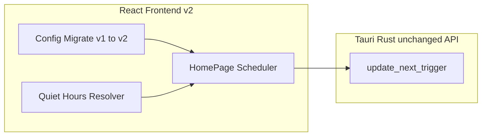
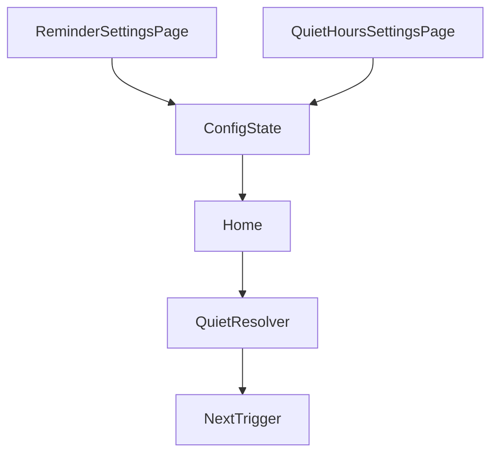
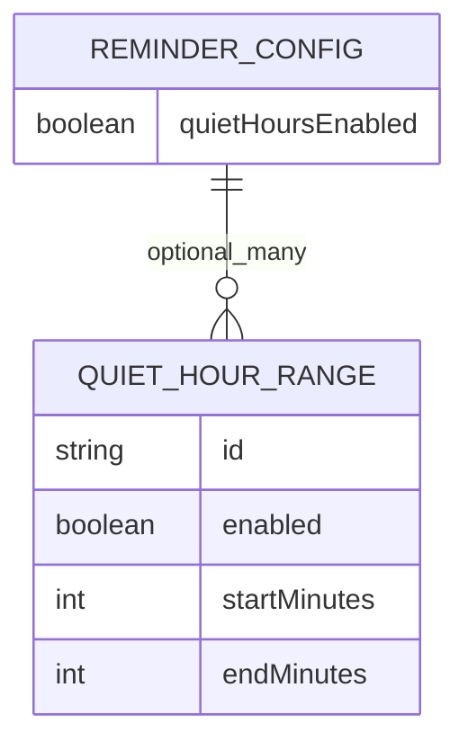

# 系统总体设计-第二版

## 1. 设计概述

### 1.1 设计目标

在第一版架构上扩展前端调度层：引入免打扰禁区模型与推迟算法；保持后端运行时镜像接口不变以降低回归面。

### 1.2 设计约束

- 后端继续不承担间隔调度职责。
- 免打扰判定使用前端本地时间。
- 时段不得跨自然日界线（不支持结束早于或等于开始的跨天解释）。

### 1.3 参考依据（需求规格说明书、全局开发共识）

《需求规格说明书-第二版》《文档元信息与全局开发共识-第二版》《系统总体设计-第一版》。

## 2. 整体架构设计

### 2.1 逻辑架构设计

在第一版基础上新增：

| 模块 | 增量职责 |
|------|----------|
| 配置模型 | `ReminderConfig` 扩展免打扰字段；迁移层 |
| 调度引擎（前端） | 候选触发 → 禁区扫描 → 链式推迟 → 提交镜像 |
| 设置 UI | 主设置视图（第一版字段集）+ 免打扰独立视图（列表 CRUD + 校验）；二者由 `HomePage` 本地视图状态切换，共享同一 `ReminderConfig` |

### 2.2 物理架构设计

不变：单机进程 + 前端存储。

### 2.3 架构拓扑图

## 3. 模块拆分与职责定义

### 3.1 核心模块拆分

- **迁移模块**：应用启动读取存储；若仅有 v1 键则生成 v2 并保留只读 v1（可选）或一次性迁移删除策略（具体以前端详细设计为准）。
- **解析模块**：将 UI 时/分输入（数字）转为「日内分钟索引」整数表示。
- **推迟模块**：核心算法，纯函数，便于单测。

### 3.2 模块职责边界

`ReminderSettingsPage` 与 `QuietHoursSettingsPage` 分别编辑主设置与免打扰字段，共同写回同一配置状态；`HomePage` 持有配置并负责调用推迟模块、将结果写入 `updateNextTrigger`。

### 3.3 模块依赖关系图

## 4. 前后端交互契约总览

### 4.1 统一请求格式规范

不变；继续 camelCase。

### 4.2 统一响应格式规范

不变。

### 4.3 全局错误码体系

维持字符串错误；前端算法超限触发本地 message 级别告警。

### 4.4 接口通用权限规则

不变。

## 5. 核心数据模型设计

### 5.1 实体关系定义

在第一版 `ReminderConfig` 上新增：

- `quietHoursEnabled: boolean`
- `quietHours: QuietHourRange[]`
  - `id: string`
  - `enabled: boolean`
  - `startMinutes: number`（0–1439）
  - `endMinutes: number`（1–1439 且大于 start）

### 5.2 ER图

### 5.3 核心数据流转规则

配置保存 → localStorage v2 → HomePage effect 计算 → `update_next_trigger` 同步运行时 → 托盘 tooltip 继续使用文案标签字段。

## 6. 核心状态机设计

### 6.1 核心业务状态定义

在第一版状态机基础上，`Armed` 状态的转移条件变更：

- 进入 `Armed` 前必须经过 Quiet Resolver。

### 6.2 状态流转规则

进行中会话状态不影响 `QuietHour` 判定路径；仅在会话结束回到调度路径时重新计算。

### 6.3 非法状态拦截规则

- `endMinutes <= startMinutes` 禁止保存。
- 列表超长禁止提交新增。

## 7. 架构风险与防控方案

### 7.1 潜在架构风险

- **链式推迟死循环**：配置重叠区间异常叠加可能导致迭代不收敛认知误解（实际有限迭代可控）。
- **夏令时跳跃**：本地时间非单调变化导致单次触发偏移。
- **用户误解跨天需求**：必须 UI 文案声明不支持跨午夜。

### 7.2 风险防控方案

- 引入硬性迭代上限 + 兜底提示。
- 在测试方案增加 DST（夏令时）切换日抽样说明。
- 设置页固定提示文案。

### 7.3 降级兜底方案

- 关闭总开关 → 立刻退回第一版路径。
- 迁移失败 → 使用默认空免打扰配置并提示。
