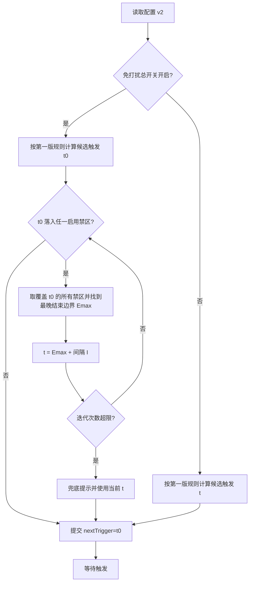
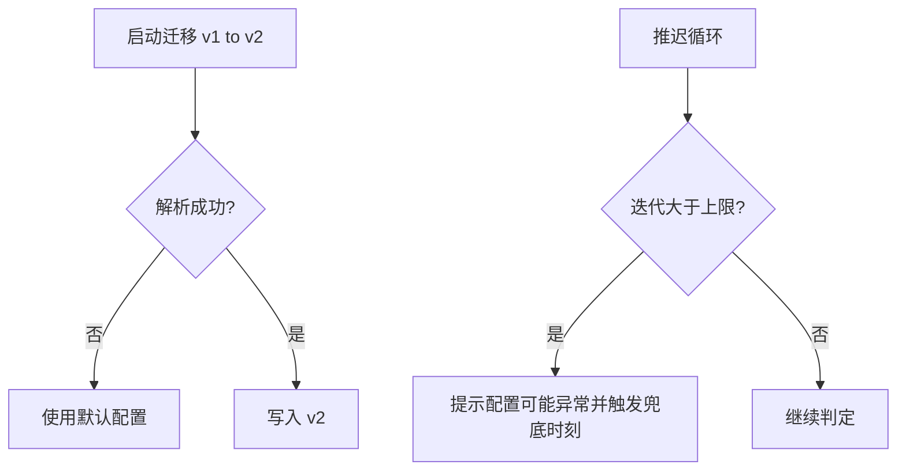

# 需求规格说明书-第二版

## 1. 需求概述

### 1.1 需求背景

用户在会议、午休等时间段不希望被久坐提醒打断，但仍希望在其余时间保持原有间隔提醒行为。

### 1.2 业务目标

在不影响第一版既有提醒主线的前提下，引入可配置的多段「免打扰时段」：时段内抑制提醒触发，并在时段结束后按规则恢复下一次触发时刻。

### 1.3 预期价值

降低提醒对专注场景的打扰，提高用户对产品的保留率与启用意愿。

## 2. 用户与场景定义

### 2.1 目标用户画像

与第一版一致；新增诉求为「日程中存在固定不希望被打扰时间段」的用户。

### 2.2 核心使用场景

- 用户启用免打扰总开关并新增两段时段（如 12:00–14:00 与 18:00–19:00），每天在上述区间内不触发提醒。
- 用户将提醒间隔设为 45 分钟，系统计算的候选触发时刻落在免打扰区间内时，自动顺延至区间结束后并再加上完整间隔（示例：候选 12:09、区间 12:00–14:00 → 下一次 14:45）。
- 用户正在进行提醒活动倒计时，本地时间进入免打扰区间：**不中断**当前会话。

### 2.3 边界使用场景

- 多个免打扰时段互相重叠：算法需等价于覆盖合并后的禁区后再推迟。
- 连续多个时段紧贴：推迟后落入下一个时段需继续递归推迟（链式跳过）。
- 用户将所有时段禁用但总开关开启：等价于无禁区（立即恢复第一版行为）。
- 调整系统本地时间：可能出现触发突变，产品接受以新时间为基准重新计算。

## 3. 分级用户故事与验收标准

### 3.1 P0 核心用户故事与可量化验收标准

| 编号 | 用户故事 | 可量化验收标准 |
|------|----------|----------------|
| US2-P0-01 | 作为用户，我希望配置多个免打扰时段并默认每日生效 | 至少可新增、删除、启用/禁用段；保存后刷新应用配置保持一致；时段字段为当日内的开始与结束时刻，结束时刻严格大于开始时刻 |
| US2-P0-02 | 作为用户，我希望候选触发时间落入免打扰时被自动推迟 | 给定间隔 I 分钟与禁区 [S,E)，若候选 t∈[S,E)，则下一次触发为 E 加上 I 分钟后的首个不落入任一启用禁区的时间点（链式迭代）；与产品确认示例 12:09→14:45（I=45）一致 |
| US2-P0-03 | 作为用户，我希望关闭免打扰总开关后立即恢复第一版调度 | 总开关关闭后调度逻辑与不启用免打扰的第一版一致；托盘行为不变 |

### 3.2 P1 重要用户故事与可量化验收标准

| 编号 | 用户故事 | 可量化验收标准 |
|------|----------|----------------|
| US2-P1-01 | 作为用户，我希望单独禁用某一免打扰段而不删除它 | 禁用段不参与命中判断；界面状态与持久化一致 |
| US2-P1-02 | 作为用户，我希望提醒进行中进入免打扰不被强行打断 | 会话激活期间不调用取消会话逻辑；会话结束后重新计算下一次触发 |
| US2-P1-03 | 作为用户，我希望防止配置数量失控 | 免打扰段数量上限默认 20；超出时阻止新增并提示 |

### 3.3 P2 次要用户故事与可量化验收标准

| 编号 | 用户故事 | 可量化验收标准 |
|------|----------|----------------|
| US2-P2-01 | 作为用户，我希望旧版本配置无缝升级 | 存在 `reminder-config-v1` 时自动迁移至 `reminder-config-v2`，默认 `quietHoursEnabled=false` 且列表为空 |
| US2-P2-02 | 作为开发者，我希望异常配置不会死循环 | 推迟迭代具备最大次数上限（默认 256），超出后采用兜底策略并记录用户可见告警文案 |

## 4. 业务流程设计

### 4.1 正常业务流程（附业务流程图）

### 4.2 异常业务流程（附异常处理流程图）

### 4.3 分支流程说明

- **进行中会话**：免打扰判定仅在「调度下一次触发」路径生效；已显示的提醒界面生命周期遵循第一版。
- **总开关关闭**：跳过所有禁区判定。
- **段级禁用**：禁用段视为不存在。

## 5. 功能边界定义

### 5.1 本次需求必须实现的功能

- `quietHoursEnabled` 总开关与 `quietHours` 列表 persistence（持久化）字段。
- 多段编辑 UI 与校验（止大于起；不支持跨午夜）。
- 免打扰编辑位于**独立设置视图**；主界面保留第一版信息架构并提供进入免打扰视图的**明确入口**（不新增后端能力）。
- 调度推迟算法与链式跳过。
- v1→v2 配置迁移与持久化键升级策略。

### 5.2 本次需求明确不实现的功能

- 托盘菜单新增免打扰快捷开关（保持三布尔不变）。
- 后端 Rust 持久化或调度迁移。
- 按星期维度配置免打扰。
- 跨午夜单段免打扰。

### 5.3 后续迭代可扩展的功能

- 按工作日/周末或自定义星期集合扩展。
- 跨午夜支持。
- 托盘展示「下次触发是否因免打扰推迟」附加标记。

## 6. 非功能需求说明

### 6.1 性能需求

推迟判定应在毫秒级完成；不得引入高频忙轮询。

### 6.2 兼容性需求

升级后旧安装用户配置可读；降级场景（用户手动删除 v2）不在支持范围但需在文档提示风险。

### 6.3 安全性需求

不接受外部导入未校验的超大 JSON 配置块；列表长度需上限。

### 6.4 可用性需求

主界面保持第一版设置布局；免打扰在独立视图中分组展示，错误即时反馈。时、分输入横向排列，主窗口在常见分辨率下尽量避免不必要的纵向滚动。

## 7. 需求变更记录

### 7.1 变更版本

第二版

### 7.2 变更内容

新增免打扰多时段及推迟算法；持久化升级。  
（2026-05-08 文档与实现对齐修订）免打扰编辑调整为独立设置视图并由主界面入口进入；时、分采用横向数字输入；主界面与免打扰页布局间距优化。数据模型、推迟算法语义与后端契约不变。

### 7.3 变更原因

用户希望在特定时间段不被提醒打断。

### 7.4 变更影响范围

前端调度核心、设置页 UI、本地存储结构；后端命令层无签名变更。
