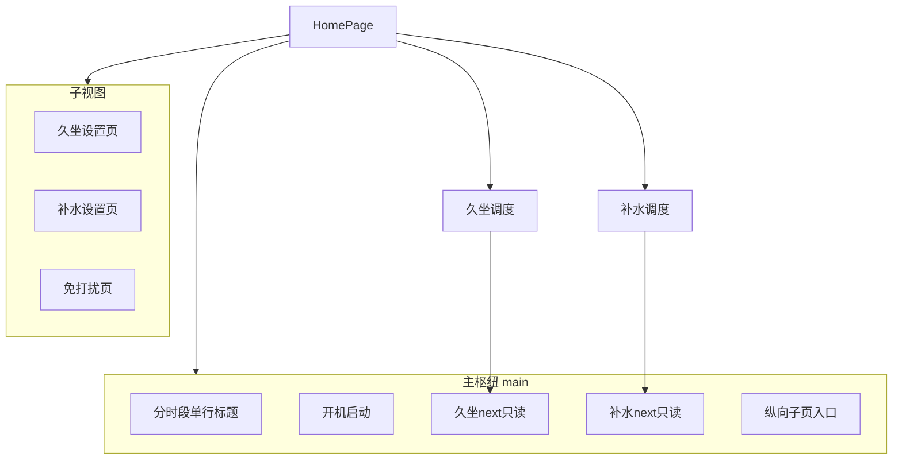
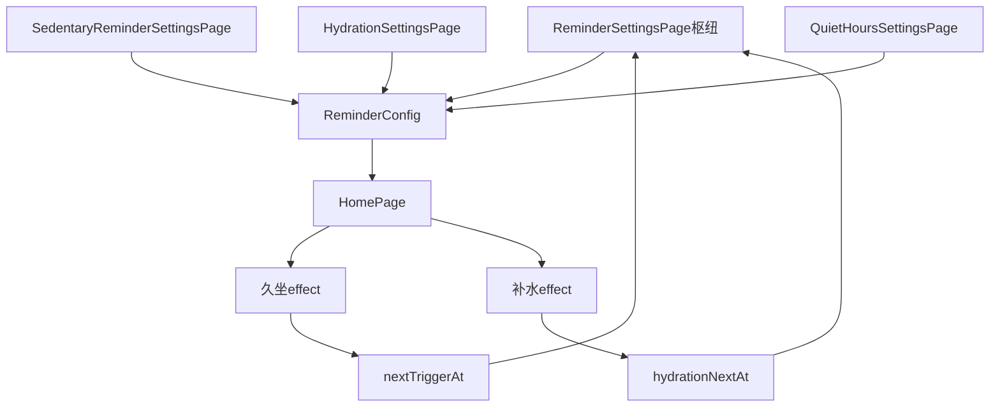

# 系统总体设计-第五版

> **【已锁定】** 锁定日期：2026-05-09。本文件为久坐提醒第五版基线文档。

## 1. 设计概述

### 1.1 设计目标

在第四版双调度与数据模型不变的前提下，重构**主界面信息架构**：枢纽只负责导航与只读摘要（开机启动、双通道 next、倒计时、子页入口）；久坐编辑下沉至独立页面；补水 next 在应用层显式状态镜像以供 UI；Card 标题承载分时段单行关怀文案。

### 1.2 设计约束

- `ReminderConfig` 不增删字段；后端命令与 `update_next_trigger` 语义不变。
- 久坐调度依赖切片与第四版一致；禁止因枢纽展示引入额外重算。
- 补水 next 镜像仅用于前端展示，不调后端。

### 1.3 参考依据（需求规格说明书、全局开发共识）

《需求规格说明书-第五版》《文档元信息与全局开发共识-第五版》《系统总体设计-第四版》。

## 2. 整体架构设计

### 2.1 逻辑架构设计

| 模块 | 第五版增量职责 |
|------|----------------|
| 枢纽 UI | `ReminderSettingsPage`：开机启动、双通道摘要、纵向入口、分时段 Card 标题 |
| 久坐编辑 UI | `SedentaryReminderSettingsPage`：原枢纽内久坐字段集合 |
| 补水编辑 UI | `HydrationSettingsPage` | 不变 |
| 免打扰 UI | `QuietHoursSettingsPage` | 不变 |
| `HomePage` | `settingsView` 增 `sedentary`；维护 `hydrationNextAt`；`main` 时秒级 `hubNowMs` |
| 久坐调度 | 与第四版一致 |
| 补水调度 | 与第四版一致，增加向 `hydrationNextAt` 同源写入 |

### 2.2 物理架构设计

不变：单机 Tauri + 前端 localStorage。

### 2.3 架构拓扑图

## 3. 模块拆分与职责定义

### 3.1 核心模块拆分

- **视图路由状态**：`main` / `sedentary` / `hydration` / `quiet`（命名与实现一致即可）。
- **展示时钟状态**：`hubNowMs`，仅 `main` 存活期间递增。
- **补水 next 镜像**：`hydrationNextAt`，与补水 `scheduleNext` 内目标时刻同步更新。

### 3.2 模块职责边界

枢纽不写久坐业务字段之外的逻辑；久坐业务写入仅在 `SedentaryReminderSettingsPage` 经 `onChange` 回写 `ReminderConfig`。

### 3.3 模块依赖关系图

## 4. 前后端交互契约总览

### 4.1 统一请求格式规范

不变；camelCase。

### 4.2 统一响应格式规范

不变。

### 4.3 全局错误码体系

不变。

### 4.4 接口通用权限规则

第五版不新增 invoke；`updateNextTrigger` 仍仅久坐路径调用。

## 5. 核心数据模型设计

### 5.1 实体关系定义

与第四版相同；`ReminderConfig` 无变更。新增仅为 **前端瞬时状态**：`hydrationNextAt`、`hubNowMs`、`settingsView` 扩展，**不**持久化。

### 5.2 ER图

与第四版一致；持久化实体无增。

### 5.3 核心数据流转规则

配置变更仍即时持久化；久坐 next 重算条件不变；补水在每次排程时写入 `hydrationNextAt`；关闭补水时置 `hydrationNextAt` 为空。

## 6. 核心状态机设计

### 6.1 核心业务状态定义

- **HubActive**：`settingsView === main`，秒级时钟运行，Card 标题随小时段变化。
- **SedentaryFullscreen**：与第四版全屏提醒状态一致；枢纽久坐摘要进入约定展示子状态。

### 6.2 状态流转规则

`main` → 子页：停秒级时钟；子页 → `main`：恢复秒级时钟并立即刷新一次 `hubNowMs`。

### 6.3 非法状态拦截规则

禁止在补水调度中写入久坐 `update_next_trigger`；禁止枢纽展示用的 `hydrationNextAt` 与定时器目标长期不一致（须同源更新）。

## 7. 架构风险与防控方案

### 7.1 潜在架构风险

秒级定时器泄漏或子页仍运行导致耗电；`hydrationNextAt` 与定时器不同步导致用户误解。

### 7.2 风险防控方案

`settingsView` 非 `main` 时清理 interval；补水 `scheduleNext` 内在设定 `setTimeout` 前更新 `hydrationNextAt`。

### 7.3 降级兜底方案

若镜像状态异常，枢纽可对补水显示「未启用」或「—」占位，但须以测试准出约束尽量不发生。
