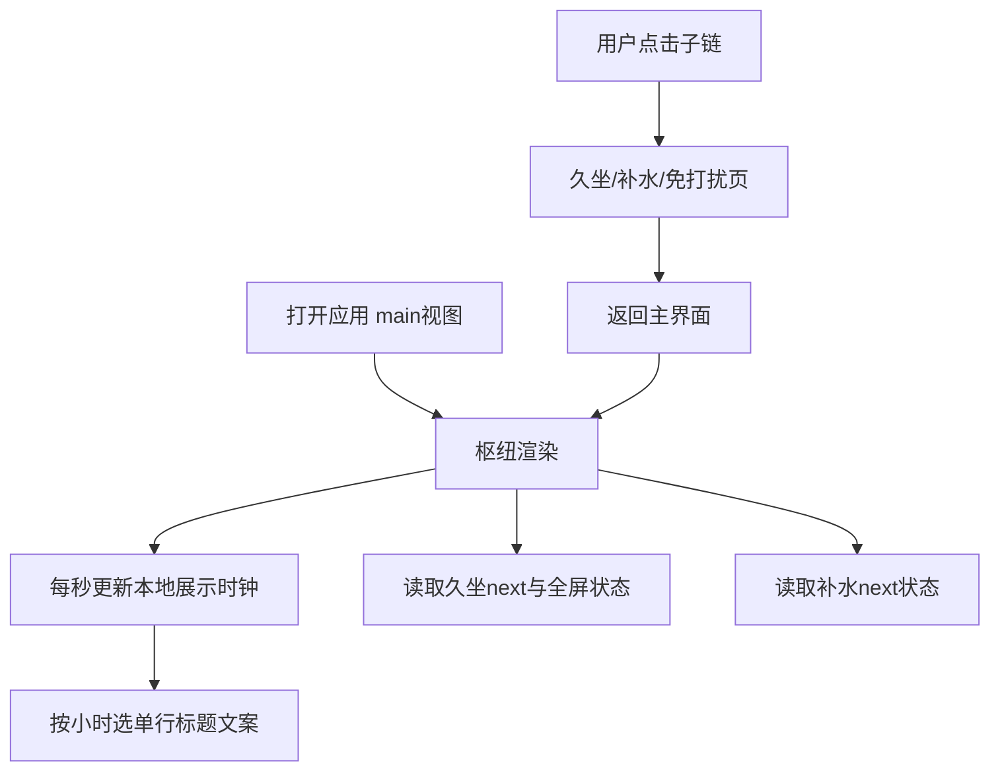
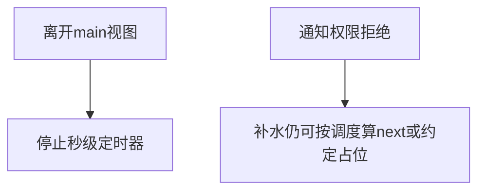

# 需求规格说明书-第五版

> **【已锁定】** 锁定日期：2026-05-09。本文件为久坐提醒第五版基线文档。

## 1. 需求概述

### 1.1 需求背景

第四版已具备补水通知、免打扰折叠与久坐/补水双调度。主界面仍将久坐表单与子页入口混排，且「下次提醒时间」仅体现久坐；用户难以一眼看到补水排程，也希望久坐配置与「入口导航」分离，并获得轻量情绪关怀。

### 1.2 业务目标

- **信息架构**：主界面成为**设置枢纽**——开机启动置顶，久坐与补水各展示下次时间与倒计时，子页链接纵向、顺序固定。
- **久坐独立页**：久坐业务配置独立成页，与补水页、免打扰页交互同构。
- **体验**：Card 标题使用**分时段单行**关怀文案，简短、不换行。

### 1.3 预期价值

降低主屏认知负荷；双通道可预期性提升；配置路径清晰；情绪价值不打断操作。

## 2. 用户与场景定义

### 2.1 目标用户画像

与第四版一致；新增关注「希望主界面一眼看到久坐和补水何时再来」的桌面用户。

### 2.2 核心使用场景

- 用户打开应用：看到分时段 Card 标题、开机启动、久坐/补水下次时间与倒计时、三个纵向入口。
- 用户点击「久坐提醒设置」：进入久坐独立页修改间隔、文案等，返回枢纽不变更第四版调度语义。
- 用户仅切换开机启动：久坐已排程的下次时刻与倒计时**不因**该操作被错误重算（与第三版以来非调度项规则一致）。

### 2.3 边界使用场景

- 久坐全屏提醒展示中：枢纽对久坐区块展示约定占位文案，补水区块仍按补水逻辑展示（若补水开启）。
- 用户离开主枢纽进入子页：枢纽秒级刷新停止，返回后恢复。
- 通知权限与补水静默：与第四版一致，不改变枢纽时间计算逻辑。

## 3. 分级用户故事与验收标准

### 3.1 P0 核心用户故事与可量化验收标准

| 编号 | 用户故事 | 可量化验收标准 |
|------|----------|----------------|
| US5-P0-01 | 作为用户，我希望主界面先看到开机启动，再看到久坐与补水的下次时间及倒计时 | 在 `main` 视图自上而下顺序为：开机启动行 → 久坐区块（下次时间+倒计时）→ 补水区块（下次时间+倒计时）→ 三个链接；无其他久坐表单字段夹在中间 |
| US5-P0-02 | 作为用户，我希望纵向进入子页且顺序固定 | 链接自上而下为：久坐提醒设置、补水提醒设置、免打扰时段设置；点击分别进入对应页，返回回到枢纽 |
| US5-P0-03 | 作为用户，我希望久坐详细配置在独立页完成 | 久坐启用、锁屏、间隔、活动倒计时、文案与随机开关**仅**出现在久坐独立页，不在枢纽出现 |
| US5-P0-04 | 作为用户，我希望补水倒计时与真实下一拍一致 | 补水开启时，枢纽展示的「下次提醒时间」与内部补水调度用于 `setTimeout` 的目标时刻为同一值更新链；关闭补水时展示为未启用类约定文案 |

### 3.2 P1 重要用户故事与可量化验收标准

| 编号 | 用户故事 | 可量化验收标准 |
|------|----------|----------------|
| US5-P1-01 | 作为用户，我希望 Card 标题是时段关怀而不是「设置」 | Card 标题字符串为产品约定的**单行**分时段文案；字符串内无换行符；本地小时变化后最多 1 秒内切换至对应时段文案（与主视图秒级刷新策略一致） |
| US5-P1-02 | 作为用户，我希望全屏久坐时能理解为何枢纽久坐时间异常 | 全屏进行中时久坐区块展示约定说明（如全屏进行中）及倒计时占位，不出现与关闭久坐相同的「未启用」误读（除非用户确已关闭久坐） |

### 3.3 P2 次要用户故事与可量化验收标准

| 编号 | 用户故事 | 可量化验收标准 |
|------|----------|----------------|
| US5-P2-01 | 作为用户，我希望窄屏下标题不被撑乱 | 标题单行省略或等价策略，不出现多行折行破坏「单行」要求 |

## 4. 业务流程设计

### 4.1 正常业务流程（附业务流程图）

### 4.2 异常业务流程（附异常处理流程图）

### 4.3 分支流程说明

- **枢纽**：只读展示双通道 next 与倒计时；编辑配置须进子页（久坐/补水/免打扰）。
- **开机启动**：仍在枢纽编辑；非调度项，不改变久坐 `nextTriggerAt` 重算规则。

## 5. 功能边界定义

### 5.1 本次需求必须实现的功能

- 枢纽布局、纵向链接顺序、久坐独立页、补水 next 状态暴露与倒计时、时段标题文案、主视图秒级刷新生命周期。

### 5.2 本次需求明确不实现的功能

- 用户自定义时段标题文案、多语言标题库、后端/托盘展示补水 next。
- 路由栈或浏览器式历史；仍为单页内视图状态机。

### 5.3 后续迭代可扩展的功能

- 标题文案 A/B 或用户自定义；托盘展示补水 next。

## 6. 非功能需求说明

### 6.1 性能需求

主视图外不跑秒级定时器；双调度链与第四版同等复杂度。

### 6.2 兼容性需求

第四版 v2 配置无 breaking；无新字段。

### 6.3 安全性需求

与第四版一致。

### 6.4 可用性需求

开机启动与托盘用词一致；久坐/补水区块标签可区分。

## 7. 需求变更记录

### 7.1 变更版本

第五版

### 7.2 变更内容

主界面枢纽化；久坐表单迁出；双通道展示；Card 分时段标题；`HomePage` 视图与状态扩展。

### 7.3 变更原因

提升可预期性与导航清晰度，补充轻量情绪价值。

### 7.4 变更影响范围

`ReminderSettingsPage`、`SedentaryReminderSettingsPage`（新增）、`HomePage`；测试用例 TC5 增量；后端无变更。
