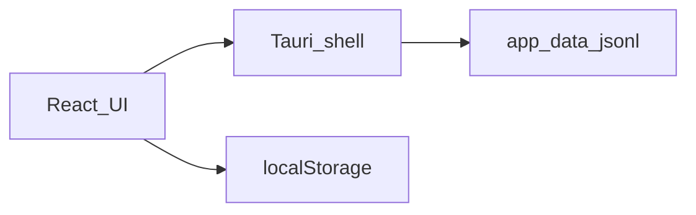
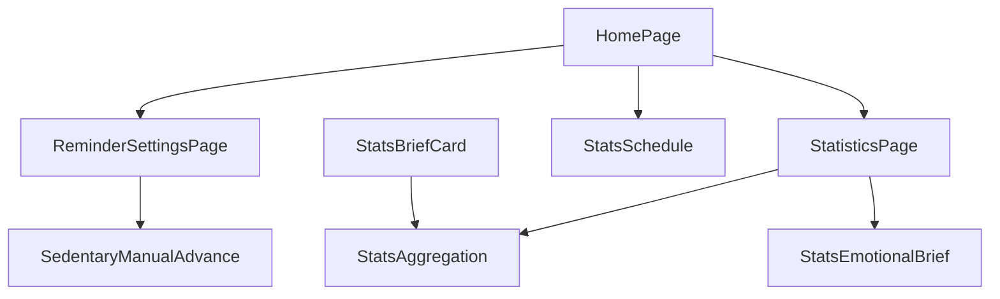

# 系统总体设计-第八版

> **【已锁定】** 锁定日期：2026-05-12。

## 1. 设计概述

### 1.1 设计目标

在第七版架构上增量：**久坐手动重排闭环**、**统计事件种类扩展**、**双序列可视化与窗口合计**、**本地情绪简报**；不改变 `ReminderConfig` 与既有 Tauri 命令集合。

### 1.2 设计约束

- 无服务端；情绪简报不调用外部 LLM。
- 不修改扩展系统 `extensions/` 核心实现。
- 不新增 Tauri 命令；统计仍通过 `record_stat_event` 写入、`query_stat_events` 读取。

### 1.3 参考依据（需求规格说明书、全局开发共识）

《需求规格说明书-第八版》《文档元信息与全局开发共识-第八版》。

## 2. 整体架构设计

### 2.1 逻辑架构设计

- **表现层**：枢纽久坐区增加手动操作；`StatisticsPage` 双序列图 + 四类合计 + 简报；`StatsBriefCard` 双序列近 7 日简报。
- **调度层**：`HomePage` 在久坐调度 effect 中依赖「配置切片 + 全屏显隐 + 手动重排 nonce」，以当前时间戳调用既有「下一拍计算」纯函数并注册单次定时触发全屏。
- **数据层**：JSONL 追加新 `kind`；前端分桶与窗口聚合纯函数模块升级；新增情绪简报纯函数模块。

### 2.2 物理架构设计

单进程桌面应用；简报模板打包于前端 bundle。

### 2.3 架构拓扑图

与第七版拓扑一致。

## 3. 模块拆分与职责定义

### 3.1 核心模块拆分

| 模块 | 职责 |
|------|------|
| SedentaryManualAdvance | 枢纽按钮、禁用条件、invoke 写统计、递增 nonce 触发重排 |
| StatsAggregation | `statsBuckets`：分桶、近 7 日简报数据、窗口合计、峰值桶标签 |
| StatsEmotionalBrief | 基于维度与合计随机选模板生成简报文案 |
| StatisticsUI | 维度切换、拉取事件、绑图与合计与简报展示 |
| HubStatsBrief | `StatsBriefCard` 嵌入枢纽，语义与统计页对齐 |

### 3.2 模块职责边界

情绪简报只读聚合结果，不写存储；手动推进不写 `ReminderConfig`；补水调度链路与久坐链路边界保持第七版分离。

### 3.3 模块依赖关系图

## 4. 前后端交互契约总览

### 4.1 统一请求格式规范

第八版无新增 `invoke` 名称；`record_stat_event` 的 `kind` 参数扩展约定值（见《后端详细设计（Rust）-第八版》统计约定节）。

### 4.2 统一响应格式规范

与第七版一致。

### 4.3 全局错误码体系

与第七版一致；写统计失败返回字符串错误信息由前端展示。

### 4.4 接口通用权限规则

与第七版一致；无 capability 变更。

## 5. 核心数据模型设计

### 5.1 实体关系定义

统计事件记录仍为扁平事件流：`kind` + `atMs`（驼峰序列化约定不变）。

### 5.2 ER图

不适用（非关系库）。

### 5.3 核心数据流转规则

| 事件 kind | 写入时机 | 消费场景 |
|-----------|----------|----------|
| sedentary_completed | 全屏活动倒计时结束 | 活动次数合并 |
| sedentary_activity_logged | 枢纽记录活动 | 活动次数合并、主动活动合计 |
| sedentary_skipped | 枢纽跳过本次 | 未活动次数、跳过合计 |
| sedentary_triggered | 全屏久坐提醒弹出 | 久坐提醒合计 |
| hydration_notified | 补水通知成功发出 | 补水合计（不进双序列堆叠图） |

## 6. 核心状态机设计

### 6.1 核心业务状态定义

- `settingsView`：与第七版相同（`main` / `sedentary` / `hydration` / `quiet` / `stats` / `author`）。
- 久坐调度：在第七版依赖集上增加 **手动重排 nonce**（整数递增），不参与配置持久化。

### 6.2 状态流转规则

点击记录活动或跳过 → 异步写统计成功路径下递增 nonce → 久坐调度 effect 清理旧单次定时器 → 以当前时刻重算 `nextTriggerAt` 并注册新定时器 → 调用托盘镜像更新。

### 6.3 非法状态拦截规则

全屏 `reminderVisible` 为真时久坐调度 effect 短路为清空 `nextTriggerAt`（与既有实现一致），与手动按钮禁用条件对齐，避免双通道竞态。

## 7. 架构风险与防控方案

### 7.1 潜在架构风险

用户高频点击导致多次写统计与多次重排；简报随机性导致验收主观差异。

### 7.2 风险防控方案

按钮禁用条件覆盖无效态；成功路径仍受单次调度 effect 合并；验收以事件写入、下一拍时间、图表与合计为准，简报以模板占位替换正确性抽检。

### 7.3 降级兜底方案

`record_stat_event` 失败时不递增 nonce、不重排，错误提示；简报模块异常时不阻断图表渲染（实现上简报与图表同源数据成功后生成）。
