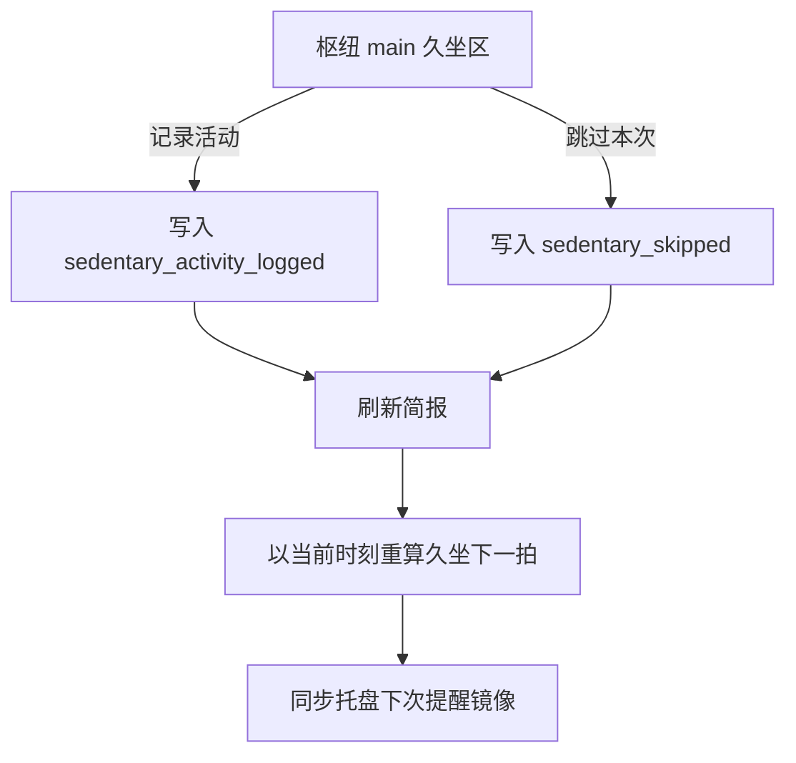
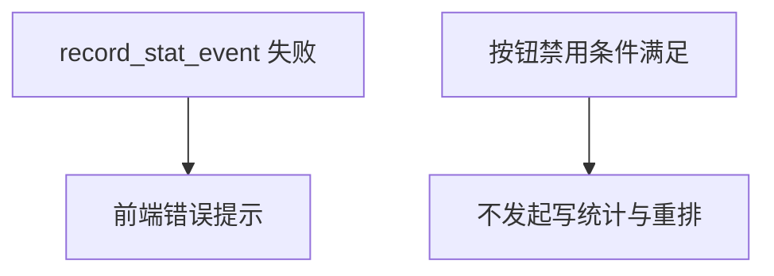

# 需求规格说明书-第八版

> **【已锁定】** 锁定日期：2026-05-12。

## 1. 需求概述

### 1.1 需求背景

第七版品牌化与随笔已稳定。用户在实际使用中希望在**未到全屏提醒**时也能主动记录已活动、或跳过当前排期，使下一久坐周期从当下重算；同时希望统计能区分「主动活动记录」「跳过」与既有完成/提醒/补水，并在活动统计页获得简短情绪反馈。

### 1.2 业务目标

- **枢纽手动推进**：主设置枢纽久坐摘要区提供「记录活动」「跳过本次」，触发后与「全屏活动结束」一致地从当前时刻重算下一拍久坐提醒。
- **统计可解释**：堆叠图展示「活动次数（完成+枢纽记录）」与「未活动次数（跳过）」；合计行单独展示久坐提醒次数、补水、主动活动、跳过。
- **情绪简报**：活动统计页在图表下方展示一条基于当前维度与合计数据的随机中文简报（本地模板，无外部 LLM）。

### 1.3 预期价值

降低「必须等到弹窗才算数」的摩擦；数据更可行动；提升统计页的情感化阅读体验。

## 2. 用户与场景定义

### 2.1 目标用户画像

久坐提醒已启用、有明确间隔规则的用户；希望在会议间隙、起身走动后主动打卡或跳过当前等待的用户。

### 2.2 核心使用场景

- 用户见倒计时仍较长 → 点击 **记录活动** → 收到成功提示 → 下次提醒时间刷新为按间隔与免打扰重算后的时刻；统计出现对应「主动活动」类事件并可并入活动次数。
- 用户暂时无法响应 → 点击 **跳过本次** → 同上重排；统计记录「跳过」并在未活动序列体现。
- 用户进入 **活动统计** → 切换日/周/月/年 → 查看双序列堆叠图、四类合计与图下简报。

### 2.3 边界使用场景

- 久坐未启用、无有效下一拍时间、或全屏久坐提醒进行中时，两按钮不可用。
- 非 Tauri 环境：`record_stat_event` 可能失败，错误提示由前端统一处理（与既有 invoke 失败策略一致）。

## 3. 分级用户故事与可量化验收标准

### 3.1 P0 核心用户故事与可量化验收标准

| 编号 | 用户故事 | 可量化验收标准 |
|------|----------|----------------|
| US8-P0-01 | 作为用户，我希望在枢纽手动记录活动并重排提醒 | 久坐已启用、存在下次时间且非全屏时，**记录活动**可点；点击后 JSONL 出现 `sedentary_activity_logged`；下次提醒时间与倒计时相对点击时刻按规则更新；出现成功提示 |
| US8-P0-02 | 作为用户，我希望跳过当前排期并重排 | 同上可用条件下 **跳过本次** 可点；JSONL 出现 `sedentary_skipped`；下次提醒时间更新；出现成功提示 |
| US8-P0-03 | 作为用户，我希望不可用时不误触 | 未启用久坐、全屏进行中、`nextSedentaryAt` 为空时两按钮 **禁用** |
| US8-P0-04 | 作为用户，我希望统计图语义清晰 | 活动统计页与主页嵌入简报堆叠图仅有 **活动次数**、**未活动次数** 两序列；活动次数=该桶内 `sedentary_completed`+`sedentary_activity_logged`；未活动次数=该桶内 `sedentary_skipped` |
| US8-P0-05 | 作为用户，我希望看到四类合计 | 活动统计页文案含：久坐提醒次数（`sedentary_triggered` 计数）、补水提醒次数、主动活动次数、跳过久坐提醒次数，且与当前维度时间窗内事件一致 |

### 3.2 P1 重要用户故事与可量化验收标准

| 编号 | 用户故事 | 可量化验收标准 |
|------|----------|----------------|
| US8-P1-01 | 作为用户，我希望简报有温度 | 活动统计页图表下方展示 **一段** 中文简报；切换维度或重新拉取数据后文案可从模板池中变化；模板池不少于 **12** 条 |
| US8-P1-02 | 作为用户，我不希望补水从堆叠图消失后被遗忘 | 合计行仍展示补水提醒次数（与第七版以来 `hydration_notified` 一致） |

### 3.3 P2 次要用户故事与可量化验收标准

| 编号 | 用户故事 | 可量化验收标准 |
|------|----------|----------------|
| US8-P2-01 | 作为开发，我希望分桶可测 | `statsBuckets` 单元测试覆盖活动合并、跳过与窗口合计 |

## 4. 业务流程设计

### 4.1 正常业务流程（附业务流程图）

### 4.2 异常业务流程（附异常处理流程图）

### 4.3 分支流程说明

- 全屏久坐提醒进行中：枢纽可能展示「全屏提醒进行中」，手动按钮禁用；活动完成路径仍写 `sedentary_completed` 并关闭全屏（与第六版以来一致）。
- 切换 `stats` 子页：`hubNowMs` 暂停规则与第七版一致；统计子页独立拉取时间窗事件。

## 5. 功能边界定义

### 5.1 本次需求必须实现的功能

枢纽双按钮、两类新统计 `kind`、双序列堆叠图（枢纽简报 + 活动统计页）、活动统计四类合计、情绪简报模块、久坐调度手动触发重算。

### 5.2 本次需求明确不实现的功能

跳过/记录活动不自动打开全屏；不新增服务端；简报不使用在线大模型；不修改 `ReminderConfig` 字段定义。

### 5.3 后续迭代可扩展的功能

简报支持用户关闭或语气偏好；导出 CSV；按周起始日配置；全屏内增加「记录等效完成」快捷入口（若产品立项）。

## 6. 非功能需求说明

### 6.1 性能需求

统计查询仍为本机 JSONL 过滤；维度切换与简报生成须在常见数据量下可感知秒内完成。

### 6.2 兼容性需求

与第七版 Windows 目标一致；分桶以本地时区日历日/周/月/年为准。

### 6.3 安全性需求

情绪简报不执行用户输入；不引入第三方脚本。

### 6.4 可用性需求

按钮文案不超过六字且语义对立清晰；成功提示一句内说明「已安排下次提醒」。

## 7. 需求变更记录

### 7.1 变更版本

第八版

### 7.2 变更内容

见本文第 1.2 节与第 3 节用户故事。

### 7.3 变更原因

降低久坐管理摩擦；提升统计可读性与情绪价值。

### 7.4 变更影响范围

前端枢纽、活动统计页、统计分桶工具、类型定义；统计 JSONL 事件种类扩展；托盘下次提醒镜像刷新频次可能增加（用户主动操作时）。
