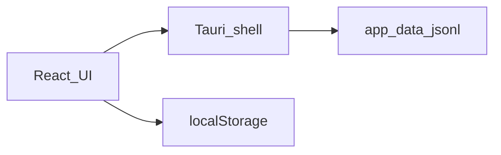
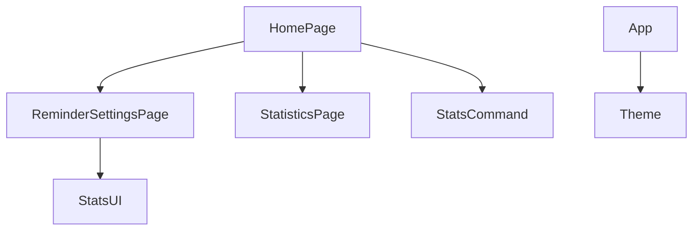

# 系统总体设计-第六版

> **【已锁定】** 锁定日期：2026-05-09。

## 1. 设计概述

### 1.1 设计目标

在第五版枢纽架构上增量：**前端主题上下文**、**统计持久化模块**、**子页统一顶栏**；保持久坐/补水调度与 `ReminderConfig` 不变。

### 1.2 设计约束

- 无服务端；统计仅存本地 JSONL。
- 不修改扩展系统 `extensions/` 核心实现。
- Ant Design 全局主题仅在根组件配置。

### 1.3 参考依据（需求规格说明书、全局开发共识）

《需求规格说明书-第六版》《文档元信息与全局开发共识-第六版》。

## 2. 整体架构设计

### 2.1 逻辑架构设计

- **表现层**：React 页面 + Ant Design + Plots。
- **壳层**：Tauri 窗口与 `invoke`。
- **数据层**：localStorage（主题、提醒配置）+ 应用数据目录（统计文件）。

### 2.2 物理架构设计

单进程桌面应用；前端打包资源由 WebView 加载。主窗口默认尺寸约 520×760，**最小**宽约 400px、高约 660px（`tauri.conf.json`）。

### 2.3 架构拓扑图

## 3. 模块拆分与职责定义

### 3.1 核心模块拆分

| 模块 | 职责 |
|------|------|
| Theme | 解析 `light/dark/system`，驱动 `ConfigProvider` 与 `setTheme` |
| StatsCommand | `record_stat_event`、`query_stat_events` |
| StatsUI | 简报卡、详情页、分桶聚合纯函数 |
| SubNav | `SubSettingsTopBar` 规范 B |

### 3.2 模块职责边界

统计模块不读写 `ReminderConfig`；主题模块不改变调度 effect 依赖。

### 3.3 模块依赖关系图

## 4. 前后端交互契约总览

### 4.1 统一请求格式规范

Tauri `invoke` 驼峰参数名与 Rust `serde` 对齐。

### 4.2 统一响应格式规范

成功返回单元或 `Vec<StatEventRecord>`；失败 `Err(String)`。

### 4.3 全局错误码体系

沿用第五版字符串错误信息；统计错误不映射 HTTP 码。

### 4.4 接口通用权限规则

`default` capability 包含新命令；`set-theme` 显式授权。

## 5. 核心数据模型设计

### 5.1 实体关系定义

- **StatEventRecord**：`kind`、`atMs`。
- **ThemeModePreference**：枚举 `light | dark | system`。

### 5.2 ER图

不适用关系型数据库。

### 5.3 核心数据流转规则

提醒触发 → 前端 `invoke record` → 追加 JSONL → 简报/详情 `invoke query` → 前端聚合。

## 6. 核心状态机设计

### 6.1 核心业务状态定义

`settingsView`: `main | sedentary | hydration | quiet | stats`。

### 6.2 状态流转规则

`main` ↔ 子页与 `stats`；全屏提醒态与第五版一致。

### 6.3 非法状态拦截规则

无；统计与视图正交。

## 7. 架构风险与防控方案

### 7.1 潜在架构风险

统计文件无限增长；图表库体积大。

### 7.2 风险防控方案

400 天裁剪 + 整文件重写；构建体积可后续做 lazy route（本版未强制）。

### 7.3 降级兜底方案

`invoke` 失败时 UI 显示空统计；主题回退浅色。
