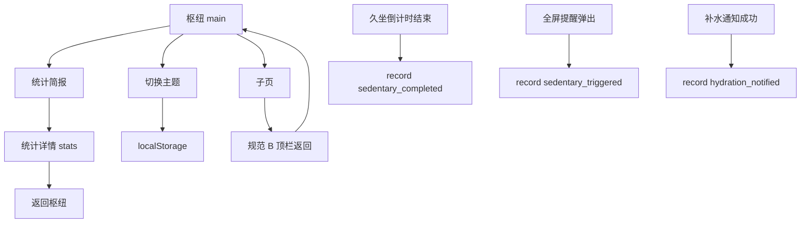
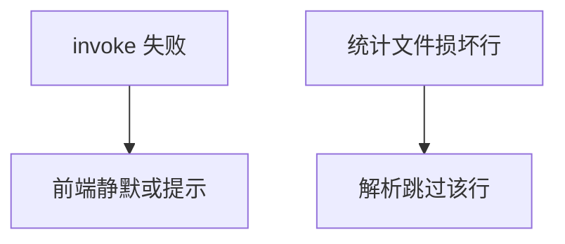

# 需求规格说明书-第六版

> **【已锁定】** 锁定日期：2026-05-09。

## 1. 需求概述

### 1.1 需求背景

第五版枢纽与双通道已稳定。用户需要 **深色模式** 与 **系统主题联动**；子页「返回主界面」在右上角不够显著；希望看到 **久坐完成与补水提醒的本地统计**，且主枢纽保持紧凑无滚动条。

### 1.2 业务目标

- **主题**：提供浅色、深色、跟随系统三档，持久化，全局 UI 一致。
- **导航**：子页采用通栏顶栏 **规范 B**（左返回 + 标题）。
- **统计**：枢纽上方简报 + 详情页多维图表；数据仅本地。

### 1.3 预期价值

护眼与系统一致性；降低返回路径认知成本；行为可量化、激励坚持。

## 2. 用户与场景定义

### 2.1 目标用户画像

久坐办公族、长时间使用桌面提醒的用户；关注深色模式与简单数据反馈的用户。

### 2.2 核心使用场景

- 用户在枢纽切换主题 → 全应用 Ant Design 主题与（可选）窗口标题栏主题同步更新。
- 用户进入久坐设置 → 首行左侧即见**仅图标**返回（悬停/读屏可见「返回主界面」）与页标题。
- 用户完成一次久坐活动 → 统计 +1；枢纽简报与详情可看到趋势。
- 用户收到补水通知成功 → 统计 +1（通知未发出不计）。

### 2.3 边界使用场景

- 浏览器非 Tauri 环境：`invoke` 失败时统计静默跳过，不影响提醒。
- 统计文件损坏或不可写：查询返回空或失败不阻断主流程。

## 3. 分级用户故事与验收标准

### 3.1 P0 核心用户故事与可量化验收标准

| 编号 | 用户故事 | 可量化验收标准 |
|------|----------|----------------|
| US6-P0-01 | 作为用户，我希望选择浅色/深色/跟随系统 | 三档 `Segmented` 可切换；刷新应用后保持；跟随系统时修改 OS 主题后 2 秒内 UI 亮暗与解析结果一致 |
| US6-P0-02 | 作为用户，我希望子页返回在左上且醒目 | 久坐/补水/免打扰三页首行左侧均为 `default` 按钮式「返回主界面」+ 标题；无 `Card.extra` 返回 |
| US6-P0-03 | 作为用户，我希望看到活动统计简报 | 枢纽「开机启动」**上方**有简报卡；展示近 7 日久坐完成柱图与今日/本周次数；点击进入详情 |
| US6-P0-04 | 作为用户，我希望按日/周/月/年看详情 | 详情页 `Segmented` 四档；柱状堆叠展示「久坐完成」「补水提醒」；合计数字与图形一致 |

### 3.2 P1 重要用户故事与可量化验收标准

| 编号 | 用户故事 | 可量化验收标准 |
|------|----------|----------------|
| US6-P1-01 | 作为用户，我希望主枢纽不要出现滚动条 | 默认窗口约 520×760、**最小约 400×660** 下，`main` 视图外层 `overflow-y: hidden` 不出现纵向滚动条 |
| US6-P1-02 | 作为用户，我希望窗口标题栏与主题协调 | Tauri 下调用 `setTheme` 成功或静默失败；不出现未捕获异常 |

### 3.3 P2 次要用户故事与可量化验收标准

| 编号 | 用户故事 | 可量化验收标准 |
|------|----------|----------------|
| US6-P2-01 | 作为用户，我希望旧数据自动清理 | 单事件时间超过约 400 天不再出现在查询结果中 |

## 4. 业务流程设计

### 4.1 正常业务流程（附业务流程图）

### 4.2 异常业务流程（附异常处理流程图）

### 4.3 分支流程说明

- **详情页**：仅视图状态 `stats`，非路由；返回 `main` 刷新简报。
- **主题**：`system` 依赖 `matchMedia` 订阅变化。

## 5. 功能边界定义

### 5.1 本次需求必须实现的功能

主题三档、规范 B 顶栏、统计持久化、简报、详情四维度、事件类型三种。

### 5.2 本次需求明确不实现的功能

云同步、账号、邮件报告、自定义统计维度、数据导出。

### 5.3 后续迭代可扩展的功能

Esc 返回子页、统计导出 CSV、更多事件类型（如跳过提醒）。

## 6. 非功能需求说明

### 6.1 性能需求

统计文件读写在常规事件量（每日数百条）下单次操作 &lt; 100ms（桌面 SSD 参考）。

### 6.2 兼容性需求

Windows 10+ 主目标；主题与统计逻辑与第五版调度共存。

### 6.3 安全性需求

统计路径限于应用数据目录；无网络传输。

### 6.4 可用性需求

简报整块可点击；图表具备基础 `tooltip`。

## 7. 需求变更记录

### 7.1 变更版本

第六版

### 7.2 变更内容

主题、规范 B、本地统计全链路。

### 7.3 变更原因

产品规划与可用性结论。

### 7.4 变更影响范围

前端 `App`、`HomePage`、枢纽与子页、后端新命令、依赖 `@ant-design/plots`。
