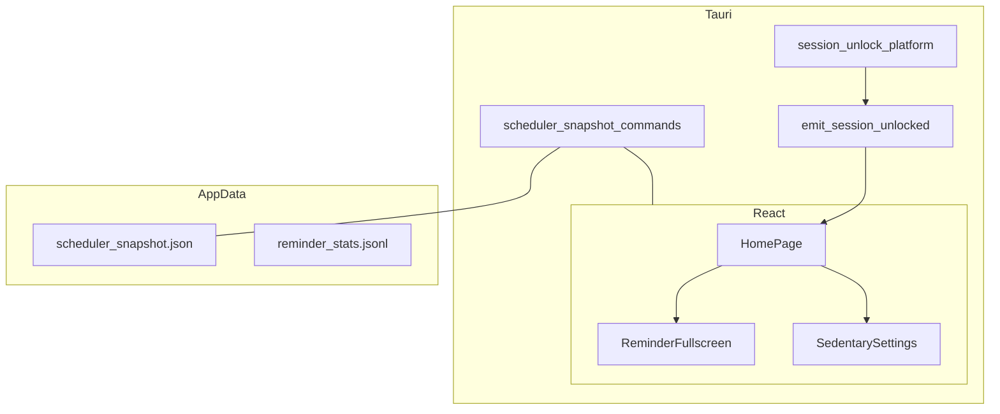
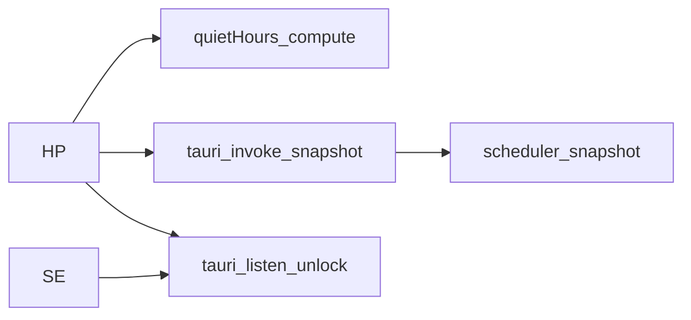
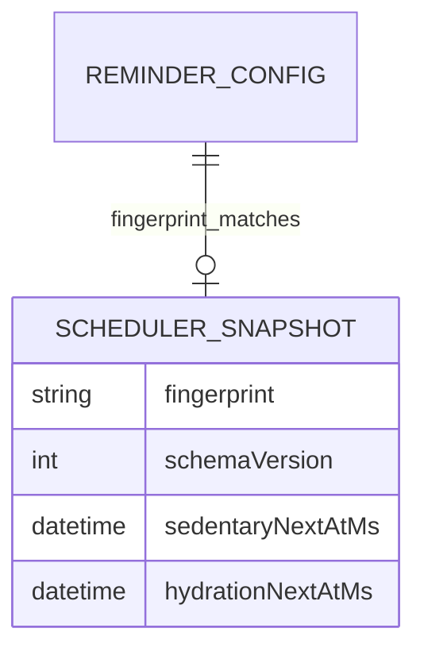

# 系统总体设计-第十版

> **【归档基线】** 与实现版本 **v0.1.10** 对齐；归档日期：2026-05-14。

## 1. 设计概述

### 1.1 设计目标

在第九版「版本与更新 + 统计与枢纽」架构之上，增加 **会话级人机状态对齐**（解锁可选记活动）、**调度状态可恢复**（快照 + 指纹）、**全屏交互可控** 与 **隐私告知**；主窗默认高度调整为 **800px**。

### 1.2 设计约束

- 不修改 `src-tauri/src/extensions/` 核心扩展目录禁区规则。
- **久坐调度主逻辑** 仍在前端 `HomePage` 编排；后端 **不承担** 间隔计算，仅提供 **快照持久化** 与 **系统事件桥接**。
- **会话解锁监听** 不得阻塞主线程消息泵；Windows 上子类化须与 **企业强控** 子类 **ID 隔离**。

### 1.3 参考依据

《需求规格说明书-第十版》《文档元信息与全局开发共识-第十版》《后端详细设计（Rust）-第十版》《前端详细设计（React）-第十版》。

## 2. 整体架构设计

### 2.1 逻辑架构设计

- **表现层（React）**：全屏页拦截 `contextmenu`；主界面底部用户须知；久坐子页配置项；`HomePage` 合并 **快照首帧** 与既有 `computeNext*` 调度；`listen("session-unlocked")`。
- **壳层（Tauri Rust）**：`scheduler_snapshot` 命令读写 `app_data_dir` 下 JSON；`session_unlock` 在 `setup` 注册，向应用 **emit** 统一事件名。
- **数据层（本地文件）**：`scheduler_snapshot.json` 与 `reminder_stats.jsonl` 并列于应用数据目录；**localStorage** 仍为提醒配置 v2 主存。

### 2.2 物理架构设计

- 单机桌面；无新增服务端组件。
- 快照与统计依赖 OS 对 **应用数据目录** 的持久化；用户清理目录即 **显式放弃** 连续性。

### 2.3 架构拓扑图

## 3. 模块拆分与职责定义

### 3.1 核心模块拆分

| 模块 | 职责 |
|------|------|
| `ReminderFullscreenPage` | 全屏可见时阻止默认右键菜单 |
| `HomePage` | 快照加载、首轮 merge、定时 persist、解锁事件响应、底部用户须知 |
| `quietHours.buildSchedulerFingerprint` | 调度指纹稳定序列化 |
| `commands/scheduler_snapshot` | 快照序列化读写 |
| `platform/session_unlock` | Win/mac 注册与 emit |

### 3.2 模块职责边界

- **`update_next_trigger`**：仍为 **运行时镜像** 供托盘等读取；**不替代** 快照文件职责。
- **`session_unlock`**：**不** 解析 `ReminderConfig`；**不** 直接写统计文件；仅 **emit**。
- **快照**：**不** 存储全量 `ReminderConfig`，仅存 **指纹串** 与 **两个时间戳**。

### 3.3 模块依赖关系图

## 4. 前后端交互契约总览

### 4.1 统一请求格式规范

- **`load_scheduler_snapshot`**：无业务入参；返回 **`Option<SchedulerSnapshot>`**（JSON 层 camelCase）。
- **`save_scheduler_snapshot`**：入参 **`snapshot`** 对象，字段 **`schemaVersion`、`fingerprint`、`sedentaryNextAtMs`、`hydrationNextAtMs`**。

### 4.2 统一响应格式规范

- 成功：`load` 返回 **对象或 null**；`save` 返回 **空**。
- 失败：Rust 侧 **`Result::Err(String)`** 映射为前端 invoke 异常；前端 `save` 可静默以免打断调度（与实现一致时须在《前端详细设计》注明）。

### 4.3 全局错误码体系

- 沿用 **字符串错误消息** 策略；快照解析失败 → **等价于无快照**（由前端 `load` 封装为 `null` 时）或显式错误（由实现择一并在测试用例固定）。

### 4.4 接口通用权限规则

- 新命令挂在 **default** capability；与既有 `record_stat_event` 一致，不新增 `fs` scope 插件。

## 5. 核心数据模型设计

### 5.1 实体关系定义

- **SchedulerSnapshot（1）** 与 **ReminderConfig（1）** 无 FK 关系；通过 **fingerprint 字符串** 弱关联。
- **StatEventRecord** 与解锁记活动：复用 **`sedentary_activity_logged`** 事件种类。

### 5.2 ER图

### 5.3 核心数据流转规则

1. 前端算出 **下一拍** → 写 **内存 state** → `update_next_trigger` → **`save_scheduler_snapshot`**（含当前指纹与双时间戳）。
2. 应用启动 → **`load_scheduler_snapshot`** → 若 `schemaVersion` 支持且 **指纹==当前配置指纹** 且时间有效 → **首轮** 调度采用快照时间。
3. 用户修改调度相关配置 → 指纹变化 → **自然丢弃** 旧快照语义（下一轮 save 覆盖）。

## 6. 核心状态机设计

### 6.1 核心业务状态定义

- **SedentaryBootstrap**：`pending`（首轮可消费快照）→ `done`（后续仅重算）。
- **HydrationBootstrap**：同上，**独立** 计数器。
- **UnlockHandling**：`idle` → `event_received` →（条件满足）→ `activity_logged_equivalent` → `idle`。

### 6.2 状态流转规则

- 全屏 **`mandatory_mode_active`** 为真时，解锁事件 **不得** 触发记活动（以前端 `reminderVisibleRef` 与后端强制态设计对齐，以前端门闩为准实现时须在测试固定）。

### 6.3 非法状态拦截规则

- **指纹不匹配** 禁止使用快照时间。
- **时间 ≤ now + 2s** 禁止使用快照时间（防重复触发与边界抖动）。

## 7. 架构风险与防控方案

### 7.1 潜在架构风险

| 风险 | 说明 |
|------|------|
| R1 | Win 子类与强控子类 **冲突** 导致消息丢失或崩溃 |
| R2 | macOS Darwin 通知名 **变更** 导致功能静默失效 |
| R3 | 快照与 localStorage 配置 **短暂不一致**（读写竞态） |

### 7.2 风险防控方案

- R1：**独立 `SUBCLASS_UID`**，链式 `DefSubclassProc`。
- R2：文档标注 **平台假设**；失败时 **无崩溃**、功能降级为关闭。
- R3：指纹取自 **当前内存 configRef**；保存与加载均在 **单线程 JS** 事件循环内顺序执行，避免并行写盘。

### 7.3 降级兜底方案

- 任快照片段损坏 → **忽略快照**。
- 监听注册失败 → **日志** + 继续启动；解锁记活动依赖平台时 **等价于关闭**。
