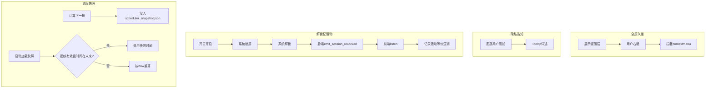
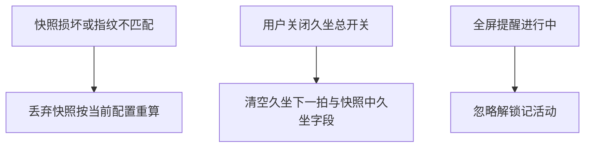

# 需求规格说明书-第十版

> **【归档基线】** 与实现版本 **v0.1.10** 对齐；归档日期：2026-05-14。

## 1. 需求概述

### 1.1 需求背景

第九版已提供版本展示、检查更新与 Win7/8/10 WebView2 兼容策略。用户反馈与产品自查仍存在：全屏提醒误触 **WebView 默认右键菜单**；对 **本地数据是否上云** 存在顾虑；锁屏后实际已离开工位但应用仍按「未活动」计时；**重启或应用更新** 后枢纽「下一拍」倒计时回到满间隔，体验不连续。

### 1.2 业务目标

- **交互可控**：全屏久坐场景下屏蔽干扰性系统菜单。
- **信任透明**：主界面显著位置告知 **数据仅存本机、默认不上传云端**。
- **状态对齐**：可选将 **系统解锁** 视为一次 **记录活动**，重排下次久坐。
- **时间连续**：在配置未变且快照仍有效时，**尽量延续** 久坐与补水 **下一拍绝对时间**。

### 1.3 预期价值

减少误操作与误解；使久坐周期更贴近真实离开/返回工位节奏；降低重启与升级带来的心理与计划打断成本。

## 2. 用户与场景定义

### 2.1 目标用户画像

长期桌面办公、使用 Windows 或 macOS、依赖久坐/补水提醒且关注隐私与连续性的用户。

### 2.2 核心使用场景

- 全屏久坐提醒显示时，用户 **右键** → **不出现** 浏览器式「返回/刷新/另存为」等菜单。
- 用户阅读主界面底部 **用户须知** 或悬停图标 → 理解 **配置、统计、调度快照仅存本机**。
- 用户在久坐子页开启 **解锁视为记录活动** → 锁屏再解锁 → **枢纽「下次久坐」重排**（与手动点「记录活动」语义一致）；若当时 **全屏提醒进行中** → **不触发**。
- 用户距下次久坐尚有 **10 分钟** 时关闭应用或完成就地升级 → 再次打开后，在 **未改间隔/免打扰** 前提下，枢纽仍显示 **约 10 分钟后**（允许 **±2 秒** 级实现误差）。

### 2.3 边界使用场景

- **卸载并删除应用数据**、更换 **bundle identifier** 安装：快照与 localStorage 不可恢复，倒计时回到按当前时刻重算，**不记为缺陷**。
- **Linux**：无会话解锁事件；开关可配置但无后端 emit，**文档与验收须明示**。
- **macOS 系统通知名变更**（极低概率）：Darwin 订阅失效时退化为「无解锁事件」，不得导致进程崩溃。

## 3. 分级用户故事与可量化验收标准

### 3.1 P0 核心用户故事与可量化验收标准

| 编号 | 用户故事 | 可量化验收标准 |
|------|----------|----------------|
| US10-P0-01 | 作为用户，我不希望在全屏久坐提醒上看到系统右键菜单 | 全屏可见期间，在提醒层 **任意区域** 右键 **10 次**，**0 次**出现默认 WebView 菜单 |
| US10-P0-02 | 作为用户，我希望主界面能读到「数据仅存本机」说明 | 主窗口底部 **版本行下方** 存在固定文案或图标入口；完整说明可在 **Tooltip** 或等价组件中 **一次性读完** |
| US10-P0-03 | 作为用户，我希望可选「解锁=记录活动」 | 久坐子页存在 **开关**；关闭时 **连续 3 次** 解锁 **0 次**改变久坐下一拍；开启时 **每次** 解锁（且非全屏提醒中）触发 **1 次** `sedentary_activity_logged` 等统计语义并重排下一拍 |
| US10-P0-04 | 作为用户，我希望重启后下一拍尽量不断档 | 在 **未修改** 调度相关配置前提下，保存快照后重启：若磁盘快照中下一拍时间 **> 当前时间 + 2s**，则枢纽展示与该时间一致的「下次提醒」**误差 ≤ 3 秒**（含渲染刷新间隔） |

### 3.2 P1 重要用户故事与可量化验收标准

| 编号 | 用户故事 | 可量化验收标准 |
|------|----------|----------------|
| US10-P1-01 | 作为用户，我希望补水下一拍也能延续 | 开启补水提醒、生成未来下一拍后重启，若指纹一致且快照有效，补水枢纽倒计时与 **快照时刻** 对齐（同 US10-P0-04 误差口径） |
| US10-P1-02 | 作为用户，我希望改间隔后旧快照不生效 | 修改久坐间隔或免打扰后 **1 秒内**，久坐下一拍 **必须** 按新配置重算，**不得**仍使用旧快照绝对时间 |

### 3.3 P2 次要用户故事与可量化验收标准

| 编号 | 用户故事 | 可量化验收标准 |
|------|----------|----------------|
| US10-P2-01 | 作为发布者，我希望 CHANGELOG 与版本一致 | `CHANGELOG.md` 存在 **`## [0.1.10]`** 小节，Release CI **通过**「从 CHANGELOG 生成 Release 正文」步骤 |
| US10-P2-02 | 作为用户，我希望主窗更高一点 | 全新安装默认主窗高度 **800px**（与 `tauri.conf.json` 一致），全屏提醒结束后恢复高度 **800px** |

## 4. 业务流程设计

### 4.1 正常业务流程（附业务流程图）

### 4.2 异常业务流程（附异常处理流程图）

### 4.3 分支流程说明

- **解锁记活动关闭**：仅 emit 事件仍可能发生（平台实现），前端 **不执行** 统计与重排。
- **久坐关闭**：久坐快照字段写 **null**；补水若仍开启则 **独立** 保存补水下一拍。
- **首轮调度已消费快照**：`sedentaryScheduleBootstrapRef` / `hydrationScheduleBootstrapRef` 置位后，后续仅按算法重算，避免长期锁死在过去快照。

## 5. 功能边界定义

### 5.1 本次需求必须实现的功能

- 全屏层 **右键菜单屏蔽**。
- 主界面底部 **用户须知**（含完整说明入口）。
- **解锁视为记录活动** 配置项 + **Windows/macOS** 解锁事件 → **`session-unlocked`** → 前端条件执行「记录活动」等价逻辑。
- **调度快照** 读写、**指纹** 校验、**首轮** 久坐/补水合并。
- 主窗 **800** 默认高度与提醒结束恢复一致。
- 久坐子页开关与标题 **同行**。

### 5.2 本次需求明确不实现的功能

- **云端账户体系**、服务端用户数据存储与分析。
- **跨设备同步** 久坐进度。
- **Linux 会话解锁** 监听。
- **全屏进行中** 的解锁记活动（明确禁止）。

### 5.3 后续迭代可扩展的功能

- 可配置 **快照松弛阈值**（默认 2s）。
- 可选 **导出/清除** 调度快照的显式用户入口。
- 其他平台（Linux）会话事件若系统 API 稳定后的补齐方案。

## 6. 非功能需求说明

### 6.1 性能需求

- 快照文件体量 **< 4KB**；读写命令在 SSD 典型环境下 **P95 < 50ms**（非严格压测指标，仅作设计预期）。
- 解锁事件回调内 **不得** 执行重磁盘 IO；仅 **emit** 与轻量状态。

### 6.2 兼容性需求

- Windows：与第九版 WebView2 策略 **兼容共存**。
- macOS：需 **macOS 10.15+**（以 `core-foundation-sys` 与 Darwin 通知可用性为工程假设，具体以 CI/mac 实机为准）。

### 6.3 安全性需求

- 快照内容 **不包含** 密钥、路径外的绝对路径、用户隐私标识。
- 子类化 / 回调不得破坏 **企业强控** 既有子类链（独立子类 ID）。

### 6.4 可用性需求

- 用户须知用语 **8～40 字**主文案可读；Tooltip 总字数 **≤ 200 字**为宜。
- 解锁记活动开关默认 **关闭**，避免误触导致周期被打乱。

## 7. 需求变更记录

### 7.1 变更版本

第十版（相对第九版增量）。

### 7.2 变更内容

见本文第 3、5 节与《文档元信息与全局开发共识-第十版》版本变更表。

### 7.3 变更原因

用户反馈与产品策略：交互、隐私透明、真实离开工位识别、调度连续性。

### 7.4 变更影响范围

前端 `HomePage`、`ReminderFullscreenPage`、`SedentaryReminderSettingsPage`、`quietHours`、`tauri` 封装；Rust `commands/scheduler_snapshot`、`platform/session_unlock`、`main` 启动链路、`tauri.conf.json` 窗口高度、`commands/reminder` 恢复尺寸；**不改变** 第九版 Updater 与统计 JSONL 语义。
