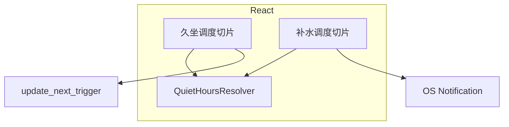
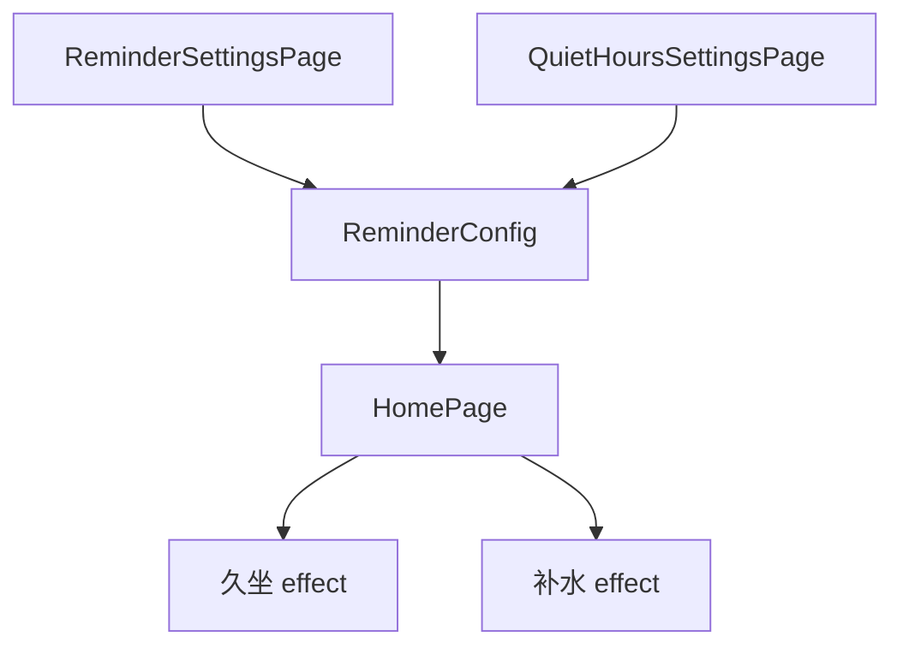

# 系统总体设计-第四版

> **【已锁定】** 锁定日期：2026-05-09。本文件为久坐提醒第四版基线文档。

## 1. 设计概述

### 1.1 设计目标

在第三版架构上增加**与久坐正交的补水调度平面**：共享免打扰判定与推迟纯函数，独立定时链与通知出口；调整免打扰设置页信息架构为**默认折叠、新增展开**。

### 1.2 设计约束

- 后端仍不承担补水调度；不扩展 `update_next_trigger` 语义。
- 持久化仍为前端 `reminder-config-v2` JSON；扩展字段向后兼容。
- 补水不进入全屏提醒状态机。

### 1.3 参考依据（需求规格说明书、全局开发共识）

《需求规格说明书-第四版》《文档元信息与全局开发共识-第四版》《系统总体设计-第三版》。

## 2. 整体架构设计

### 2.1 逻辑架构设计

| 模块 | 第四版增量职责 |
|------|----------------|
| 久坐调度（HomePage） | 与第三版一致 |
| 补水调度（HomePage） | 监听补水开关、补水间隔、免打扰；`computeNextIntervalFireWithQuietHours` 排程；触发仅 `sendNotification` |
| 推迟模块（quietHours） | 导出单间隔入口，供久坐（多规则最小候选）与补水（单候选）复用内部推迟循环语义 |
| 免打扰 UI | Collapse 受控 `activeKey`；初始空；新增时段写入配置后 `activeKey=[新 id]` |

### 2.2 物理架构设计

不变：单机 Tauri + 前端 localStorage。

### 2.3 架构拓扑图

## 3. 模块拆分与职责定义

### 3.1 核心模块拆分

- **补水调度切片**：`hydrationReminderEnabled`、`hydrationIntervalMinutes`、`quietHoursEnabled`、`quietHours`。
- **时段 UI 状态**：`QuietHoursSettingsPage` 本地 `activeKey`，不参与 `ReminderConfig`。

### 3.2 模块职责边界

设置页只回写 `ReminderConfig`；补水不调用 `updateNextTrigger`。

### 3.3 模块依赖关系图

## 4. 前后端交互契约总览

### 4.1 统一请求格式规范

不变；camelCase。

### 4.2 统一响应格式规范

不变。

### 4.3 全局错误码体系

不变。

### 4.4 接口通用权限规则

第四版不新增 invoke。

## 5. 核心数据模型设计

### 5.1 实体关系定义

`ReminderConfig` 增加：

- `hydrationReminderEnabled: boolean`
- `hydrationIntervalMinutes: number`（1–360）

与 `QuietHourRange` 关系不变。

### 5.2 ER图

同第三版；`REMINDER_CONFIG` 节点增加上述两属性。

### 5.3 核心数据流转规则

配置变更即时持久化；久坐 next 重算条件与第三版相同；补水独立重算其下次触发时刻（内存内，不镜像到后端）。

## 6. 核心状态机设计

### 6.1 核心业务状态定义

- **补水 Armed**：补水开启时维护下一次计划通知时间（内部定时器）；关闭时清除。
- 与久坐 `Armed` 无互斥（除用户同时关闭补水）。

### 6.2 状态流转规则

免打扰进入：跳过发送，重算下一时刻；与久坐推迟一致。

### 6.3 非法状态拦截规则

间隔越界时清洗为边界值；与久坐间隔一致。

## 7. 架构风险与防控方案

### 7.1 潜在架构风险

双定时器维护遗漏清理导致重复通知。

### 7.2 风险防控方案

补水 `useEffect` 返回函数清理 `setTimeout`；依赖变化时先清理再排程。

### 7.3 降级兜底方案

关闭补水开关即停；权限失败静默。
