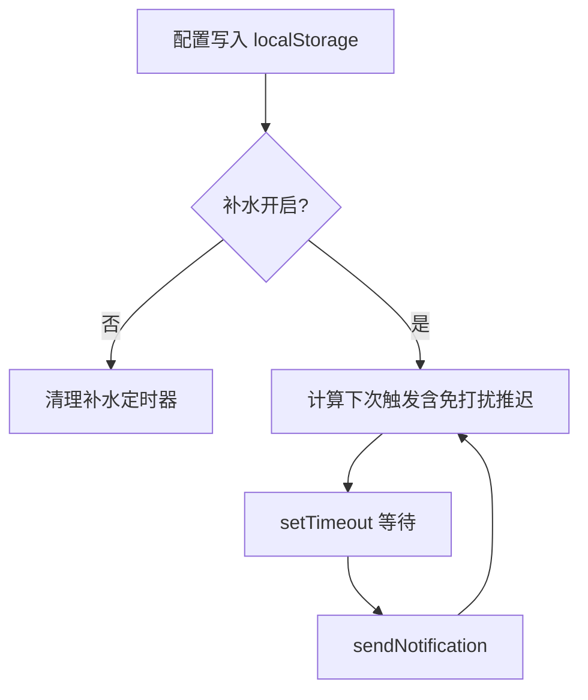
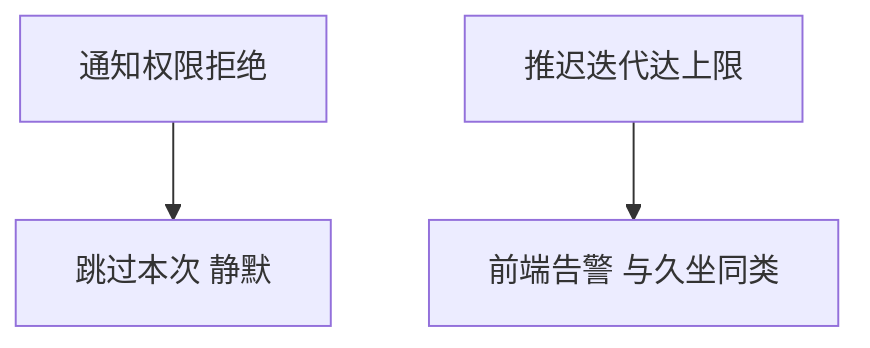

# 需求规格说明书-第四版

> **【已锁定】** 锁定日期：2026-05-09。本文件为久坐提醒第四版基线文档。

## 1. 需求概述

### 1.1 需求背景

第三版已落实久坐调度边界、免打扰折叠与跨午夜推迟。用户仍希望在久坐全屏提醒之外，以**轻量方式**养成喝水习惯；同时免打扰列表在「默认全展开」下首屏过长，希望默认折叠并在新增时聚焦新段。

### 1.2 业务目标

- **补水**：按用户设定间隔发送**仅系统通知**的喝水提醒；与久坐全屏流程解耦。
- **一致休息窗口**：补水在免打扰时段内不打扰用户（与久坐禁区一致）。
- **更高效编辑**：免打扰页默认折叠；新增时段时自动展开新段便于编辑。

### 1.3 预期价值

提升健康行为覆盖（饮水）而不增加打断强度；降低免打扰设置页认知负担。

## 2. 用户与场景定义

### 2.1 目标用户画像

与第三版一致；新增关注「需要喝水提醒但不想全屏打断」的桌面办公用户。

### 2.2 核心使用场景

- 用户在主设置开启补水提醒，设置间隔（如每 10 分钟）；系统在非免打扰时刻到达间隔后弹出系统通知，无全屏页。
- 用户配置夜间免打扰（含跨午夜）；夜间不收到补水通知；离开禁区后按「离开边界 + 补水间隔」恢复排程。
- 用户打开免打扰页：所有已有时段呈折叠，仅标题见摘要；点击新增后，新段展开，旧段仍折叠。

### 2.3 边界使用场景

- 久坐提醒总开关关闭：补水仍可独立工作（仅当补水开关开启）。
- 通知权限拒绝：补水不弹窗、不崩溃，静默跳过直至权限可用。
- 用户手动展开多段：允许；与默认折叠不冲突。

## 3. 分级用户故事与验收标准

### 3.1 P0 核心用户故事与可量化验收标准

| 编号 | 用户故事 | 可量化验收标准 |
|------|----------|----------------|
| US4-P0-01 | 作为用户，我希望开启补水提醒并按间隔收到仅通知的提醒 | 开启 `hydrationReminderEnabled`、间隔设为 N∈[1,360]；在非免打扰时刻，两次成功通知之间的时间间隔符合推迟算法下的「间隔 N 分钟」语义（自动化或手工计时抽样）；全程无全屏提醒、无 `update_next_trigger` 变化归因于补水 |
| US4-P0-02 | 作为用户，我希望免打扰时段内不收到补水通知 | 免打扰开启且存在启用段覆盖当前时刻时，60 秒内无补水通知；离开段后按链式规则在「边界 + N 分钟」后可再次收到 |
| US4-P0-03 | 作为用户，我希望免打扰页默认折叠且新增只展开新段 | 进入页面时 `activeKey` 等价于无展开；新增一段后仅该段 `id` 处于展开态；折叠标题仍满足第三版 US3-P1-01/02 摘要与禁用标识 |

### 3.2 P1 重要用户故事与可量化验收标准

| 编号 | 用户故事 | 可量化验收标准 |
|------|----------|----------------|
| US4-P1-01 | 作为用户，我希望升级应用后补水默认关闭 | 旧 v2 JSON 无补水字段时，加载后 `hydrationReminderEnabled=false`，间隔默认 60 |
| US4-P1-02 | 作为用户，我希望主界面「下次提醒时间」不因补水配置而变 | 仅修改补水开关或补水间隔时，久坐 next 展示与镜像与操作前一致（久坐仍启用且未改调度字段） |

### 3.3 P2 次要用户故事与可量化验收标准

| 编号 | 用户故事 | 可量化验收标准 |
|------|----------|----------------|
| US4-P2-01 | 作为用户，我希望删除某段后界面不残留展开键 | 删除段后若其 `id` 在受控 `activeKey` 中，应移除，无控制台报错 |

## 4. 业务流程设计

### 4.1 正常业务流程（附业务流程图）

### 4.2 异常业务流程（附异常处理流程图）

### 4.3 分支流程说明

- **补水调度字段**：`hydrationReminderEnabled`、`hydrationIntervalMinutes`、以及免打扰 `quietHoursEnabled`、`quietHours`（仅影响是否发送与何时可发送）。
- **久坐调度字段**：与第三版一致；补水字段**不属于**久坐调度切片。

## 5. 功能边界定义

### 5.1 本次需求必须实现的功能

- 补水设置 UI、持久化、前端定时链、系统通知、免打扰推迟共用语义。
- 免打扰 Collapse 受控与新增展开策略。

### 5.2 本次需求明确不实现的功能

- 补水自定义文案、补水独立免打扰表。
- 后端持久化或托盘展示补水下次时间。
- 折叠状态跨会话持久化。

### 5.3 后续迭代可扩展的功能

- 补水文案可配置、补水统计。

## 6. 非功能需求说明

### 6.1 性能需求

双定时链（久坐 + 补水）不得引入明显 CPU 占用；仍使用单次 `setTimeout` 链为主。

### 6.2 兼容性需求

第三版 v2 配置无 breaking；新增字段可选。

### 6.3 安全性需求

与第三版一致。

### 6.4 可用性需求

主设置页对补水有简短说明（仅通知、尊重免打扰）。

## 7. 需求变更记录

### 7.1 变更版本

第四版

### 7.2 变更内容

新增补水提醒；废止第三版 **US3-P1-03**（默认全部展开），代之以 US4-P0-03。

### 7.3 变更原因

饮水提醒场景与免打扰列表交互优化。

### 7.4 变更影响范围

`ReminderConfig`、`quietHours` 工具、`ReminderSettingsPage`、`QuietHoursSettingsPage`、`HomePage`；测试用例增量。
